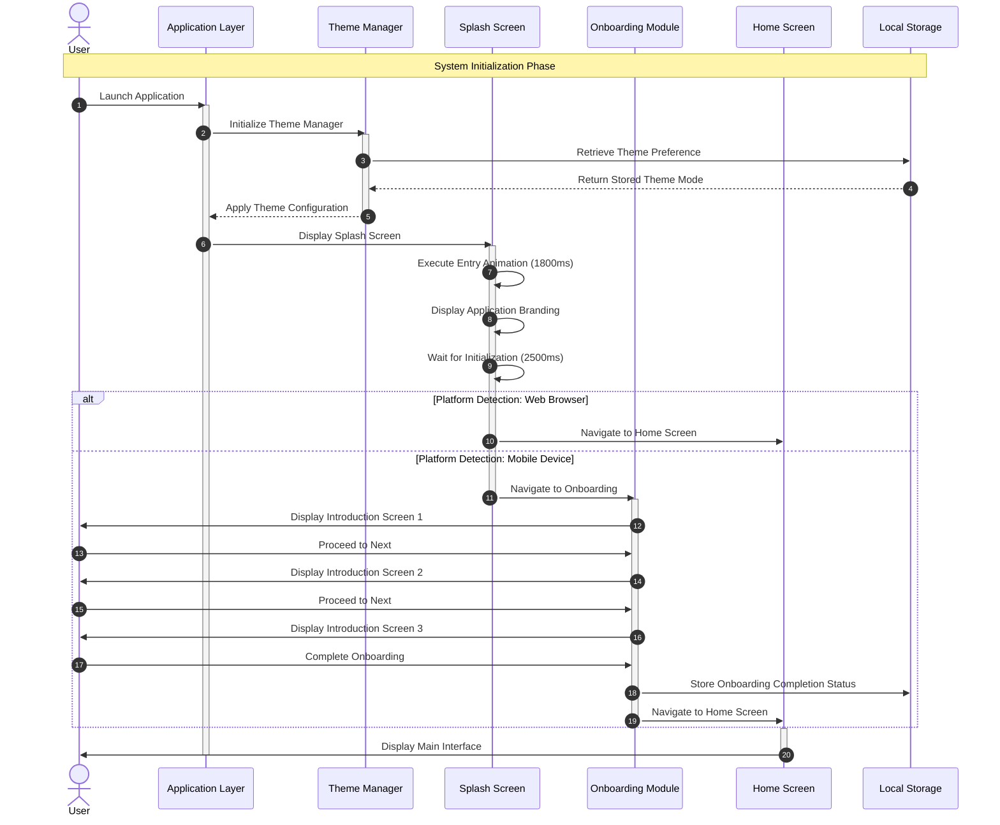
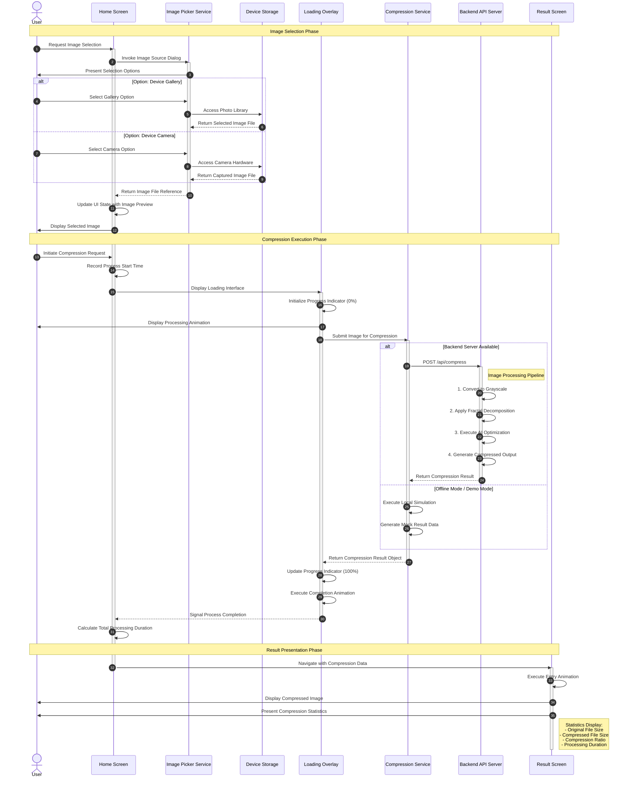
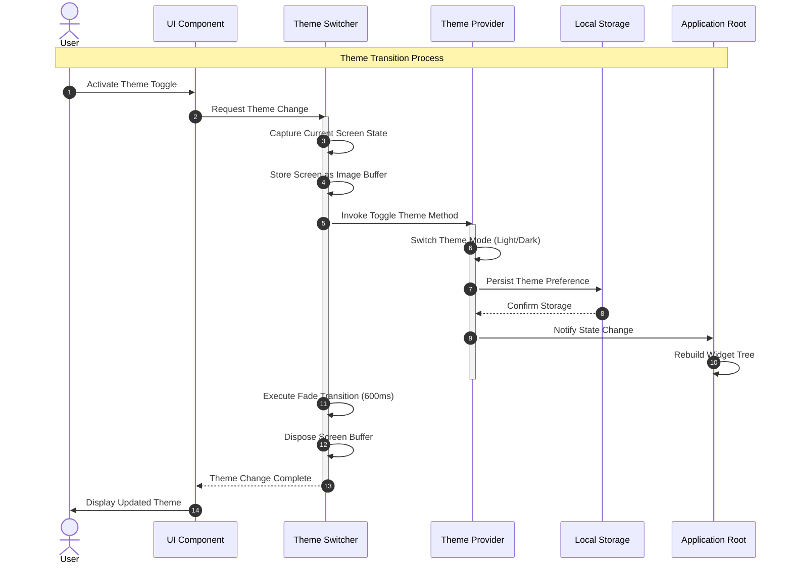
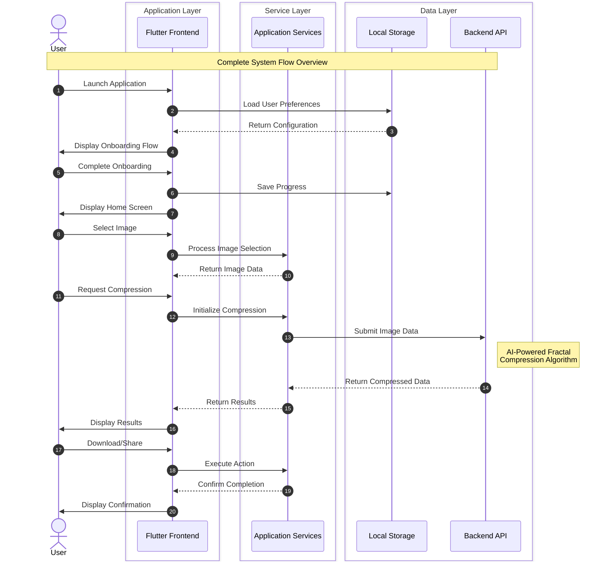

# DeepFract - UML Sequence Diagrams

## Fractal Image Compression Using AI Techniques

### Academic Documentation for Graduation Project

---

## 1. Main Application Flow Sequence Diagram



---

## 2. Image Compression Process Sequence Diagram



---

## 3. Result Screen Interaction Sequence Diagram

```mermaid
sequenceDiagram
    autonumber

    actor User
    participant ResultScreen as Result Screen
    participant FileSystem as File System
    participant ShareService as Share Service
    participant AlertDialog as Alert Dialog
    participant UploadModal as Upload Modal
    participant CompressionService as Compression Service

    Note over User, CompressionService: User Interaction with Results

    activate ResultScreen
    ResultScreen->>User: Display Compression Results

    alt Action: View Toggle
        User->>ResultScreen: Toggle Image View Mode
        ResultScreen->>ResultScreen: Switch Between Original/Compressed
        ResultScreen->>User: Update Image Display
    end

    alt Action: Download Image
        User->>ResultScreen: Request Download
        ResultScreen->>FileSystem: Save Compressed Image
        FileSystem-->>ResultScreen: Confirm Save Location
        ResultScreen->>User: Display Success Notification
    end

    alt Action: Share Image
        User->>ResultScreen: Request Share
        ResultScreen->>ShareService: Invoke System Share Dialog
        activate ShareService
        ShareService->>ShareService: Prepare Share Intent
        ShareService->>User: Display Share Options
        User->>ShareService: Select Share Target
        ShareService-->>ResultScreen: Confirm Share Completion
        deactivate ShareService
    end

    alt Action: Process New Image
        User->>ResultScreen: Request New Compression
        ResultScreen->>AlertDialog: Display Confirmation Dialog
        activate AlertDialog
        AlertDialog->>User: Warn About Unsaved Changes

        alt User Response: Confirm
            User->>AlertDialog: Confirm Action
            AlertDialog-->>ResultScreen: Return Confirmation
            deactivate AlertDialog

            ResultScreen->>UploadModal: Display Image Selection
            activate UploadModal
            UploadModal->>User: Present Upload Interface
            User->>UploadModal: Select New Image
            UploadModal-->>ResultScreen: Return New Image Data
            deactivate UploadModal

            ResultScreen->>CompressionService: Process New Image
            CompressionService-->>ResultScreen: Return New Results
            ResultScreen->>ResultScreen: Update Display State
            ResultScreen->>User: Display New Results

        else User Response: Cancel
            User->>AlertDialog: Cancel Action
            AlertDialog-->>ResultScreen: Return Cancellation
            deactivate AlertDialog
        end
    end

    deactivate ResultScreen
```

---

## 4. Theme Management Sequence Diagram



---

## 5. System Overview Sequence Diagram (Simplified)



---

## Diagram Descriptions for Academic Discussion

### 1. Main Application Flow

This diagram illustrates the **initialization sequence** of the DeepFract application, demonstrating the interaction between the application layer, theme management system, and navigation flow. Key aspects include:

- Platform-specific routing (Web vs. Mobile)
- Persistent theme preference handling
- Progressive onboarding implementation

### 2. Image Compression Process

This diagram represents the **core functionality** of the system - the image compression workflow. It demonstrates:

- Service-oriented architecture for image handling
- Asynchronous processing with visual feedback
- Backend integration points for AI-powered compression
- Fallback mechanisms for offline operation

### 3. Result Screen Interaction

This diagram shows the **user interaction patterns** available after compression:

- View toggling between original and compressed states
- File system integration for downloads
- Platform-agnostic sharing capabilities
- Seamless workflow for processing multiple images

### 4. Theme Management

This diagram illustrates the **reactive state management** approach:

- Screen capture for smooth transitions
- Provider pattern for state propagation
- Persistent storage integration
- Widget tree reconstruction

### 5. System Overview

This diagram provides a **high-level architectural view** showing the three-tier architecture:

- Presentation Layer (Flutter Frontend)
- Business Logic Layer (Application Services)
- Data Access Layer (Local Storage + Backend API)

---

## Technical Notes

| Component             | Technology        | Purpose                     |
| --------------------- | ----------------- | --------------------------- |
| Frontend              | Flutter/Dart      | Cross-platform UI           |
| State Management      | Provider          | Reactive state handling     |
| Local Storage         | SharedPreferences | User preference persistence |
| Image Handling        | image_picker      | Platform image access       |
| Backend Communication | HTTP/REST         | API integration (planned)   |
| Compression Algorithm | Fractal + AI      | Core processing logic       |

---

## References

- UML 2.5 Specification (OMG)
- Flutter Documentation (flutter.dev)
- Clean Architecture Principles (Robert C. Martin)
