# DeepFract - Block Diagram

## Fractal Image Compression Application Using AI Techniques

### Graduation Project - System Architecture

---

## PlantUML Block Diagram (Academic Format)


---

## Mermaid Block Diagram


---

## Simplified Block Diagram

```mermaid
%%{init: {'theme': 'base'}}%%
flowchart TB
    subgraph USER["👤 USER"]
        Mobile["Mobile App"]
        Web["Web App"]
    end

    subgraph UI["📱 USER INTERFACE"]
        Screens["Screens\n─────────\n• Splash\n• Onboarding\n• Home\n• Result"]
        Widgets["Widgets\n─────────\n• Theme Toggle\n• Upload Modal\n• Loading\n• Stats"]
    end

    subgraph APP["⚙️ APPLICATION LOGIC"]
        Services["Services\n─────────\n• Image Picker\n• Compression\n• Theme\n• Share"]
        State["State Management\n─────────\n• Providers\n• Notifiers"]
    end

    subgraph DATA["💾 DATA"]
        Local["Local Storage\n─────────\n• Preferences\n• Files"]
        API["API Client\n─────────\n• HTTP\n• Handlers"]
    end

    subgraph EXTERNAL["🌐 EXTERNAL"]
        Hardware["Device\n─────────\n• Camera\n• Gallery"]
        Backend["Backend\n─────────\n• AI Engine\n• Processor"]
        Share["Share\n─────────\n• WhatsApp\n• Email"]
    end

    USER --> UI
    UI --> APP
    APP --> DATA
    DATA --> EXTERNAL

    style USER fill:#E3F2FD,stroke:#000
    style UI fill:#E8F5E9,stroke:#000
    style APP fill:#FFF3E0,stroke:#000
    style DATA fill:#FCE4EC,stroke:#000
    style EXTERNAL fill:#F3E5F5,stroke:#000
```



---

## Layer Description Table

| Layer                  | Components                            | Responsibility                             |
| ---------------------- | ------------------------------------- | ------------------------------------------ |
| **User Layer**         | Mobile User, Web User                 | End-users interacting with the application |
| **Presentation Layer** | Screens, Widgets, Navigation          | UI rendering and user interaction handling |
| **Application Layer**  | Services, State Management            | Business logic and application state       |
| **Data Layer**         | Local Storage, API Client             | Data persistence and network communication |
| **External Systems**   | Device Hardware, Backend, Third-Party | External integrations and services         |

---

## Component Description Table

### Presentation Layer Components

| Component          | Description                                        |
| ------------------ | -------------------------------------------------- |
| Splash Screen      | Initial branding display with animation            |
| Onboarding Screen  | User introduction tutorial (3 screens)             |
| Home Screen        | Main interface for image selection and compression |
| Result Screen      | Compressed image display with statistics           |
| Theme Toggle       | Light/Dark mode switch widget                      |
| Upload Modal       | Image source selection dialog                      |
| Loading Overlay    | Progress indicator during compression              |
| Statistics Display | Compression ratio and metrics display              |
| Route Manager      | Navigation controller for screen transitions       |

### Application Layer Components

| Component            | Description                                  |
| -------------------- | -------------------------------------------- |
| Image Picker Service | Handles camera and gallery image acquisition |
| Compression Service  | Manages image compression workflow           |
| Theme Service        | Controls application theme state             |
| Share Service        | Handles image sharing to external apps       |
| Theme Provider       | State notifier for theme changes             |
| Image State          | Current selected image state                 |
| Compression State    | Compression progress and result state        |

### Data Layer Components

| Component          | Description                            |
| ------------------ | -------------------------------------- |
| Shared Preferences | Key-value storage for user preferences |
| File System        | Local file storage for images          |
| HTTP Client        | Network request handler                |
| API Handler        | Backend API communication manager      |

### External System Components

| Component             | Description                            |
| --------------------- | -------------------------------------- |
| Camera                | Device camera hardware interface       |
| Gallery               | Device image gallery access            |
| AI Compression Engine | Backend fractal compression algorithm  |
| Image Processor       | Image preprocessing and postprocessing |
| Share Platform APIs   | WhatsApp, Email, social media APIs     |

---

## Data Flow Between Layers

```
┌─────────────────────────────────────────────────────────────────┐
│                         USER LAYER                              │
│                   Mobile User ←→ Web User                       │
└─────────────────────────────┬───────────────────────────────────┘
                              │ User Input / UI Display
                              ▼
┌─────────────────────────────────────────────────────────────────┐
│                    PRESENTATION LAYER                           │
│         Screens ←→ Widgets ←→ Route Manager                     │
└─────────────────────────────┬───────────────────────────────────┘
                              │ Events / State Updates
                              ▼
┌─────────────────────────────────────────────────────────────────┐
│                    APPLICATION LAYER                            │
│              Services ←→ State Management                       │
└─────────────────────────────┬───────────────────────────────────┘
                              │ Data Operations
                              ▼
┌─────────────────────────────────────────────────────────────────┐
│                       DATA LAYER                                │
│            Local Storage ←→ API Client                          │
└─────────────────────────────┬───────────────────────────────────┘
                              │ I/O Operations
                              ▼
┌─────────────────────────────────────────────────────────────────┐
│                    EXTERNAL SYSTEMS                             │
│      Device Hardware ←→ Backend Server ←→ Third-Party           │
└─────────────────────────────────────────────────────────────────┘
```

---

## How to Generate

### PlantUML:

1. Go to **http://www.plantuml.com/plantuml/uml/**
2. Paste the PlantUML code
3. Download as PNG/SVG

### Draw.io:

1. **Arrange → Insert → Advanced → Mermaid**
2. Paste the Mermaid code
3. Click **Insert**
