# DeepFract - Component Diagram

## UML Component Diagram (Proper Notation)

### Fractal Image Compression Using AI Techniques

---

## PlantUML Component Diagram

---

## Simplified Component Diagram

---

## Mermaid Component Diagram (UML Style)

```mermaid
flowchart LR
    subgraph DeepFract["DeepFract Application"]
        subgraph UI["UI Layer"]
            Screens["📱 Screens"]
            Widgets["🧩 Widgets"]
        end

        subgraph Services["Service Layer"]
            IS(("○"))
            IC(("○"))
            IT(("○"))
            ImageSvc["Image Picker"]
            CompSvc["Compression"]
            ThemeSvc["Theme"]
        end

        subgraph Data["Data Layer"]
            Storage["Local Storage"]
            HTTP["HTTP Client"]
        end
    end

    subgraph External["External"]
        Backend["Backend Server"]
        Camera["Camera"]
        Gallery["Gallery"]
    end

    Screens -->|uses| IS
    IS --- ImageSvc
    Screens -->|uses| IC
    IC --- CompSvc
    Widgets -->|uses| IT
    IT --- ThemeSvc

    ImageSvc --> Camera
    ImageSvc --> Gallery
    CompSvc --> HTTP
    HTTP --> Backend
    ThemeSvc --> Storage
```

---

## Component Notation Guide

| Symbol              | Meaning            |
| ------------------- | ------------------ |
| Rectangle with tabs | Component          |
| Lollipop (○—)       | Provided Interface |
| Socket (◠)          | Required Interface |
| Solid Arrow         | Dependency         |
| Dashed Arrow        | Uses               |

---

## Components and Interfaces

| Component            | Provided Interface | Description           |
| -------------------- | ------------------ | --------------------- |
| Image Picker Service | IImagePicker       | Camera/Gallery access |
| Compression Service  | ICompression       | Image compression     |
| Theme Service        | ITheme             | Theme management      |
| Share Service        | IShare             | Image sharing         |
| Local Storage        | IStorage           | Data persistence      |
| HTTP Client          | IHTTP              | API communication     |

---

## Generate at:

**http://www.plantuml.com/plantuml/uml/**
