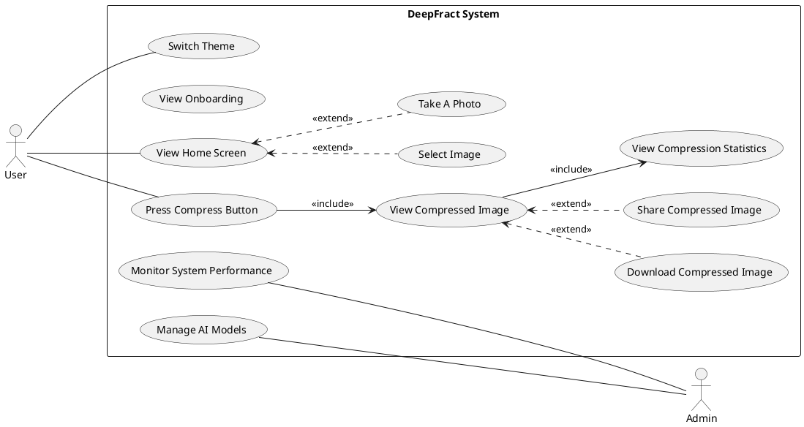

# DeepFract - Use Case Diagram

## Fractal Image Compression Using AI Techniques

### Graduation Project - UML Documentation

---

## PlantUML Code

---

## Changes Made

| Before                                  | After                                                |
| --------------------------------------- | ---------------------------------------------------- |
| `(View Home Screen) --- (Select Image)` | `(View Home Screen) <.. (Select Image) : <<extend>>` |
| `(View Home Screen) --- (Take A Photo)` | `(View Home Screen) <.. (Take A Photo) : <<extend>>` |

Now **Select Image** and **Take A Photo** are shown as **extend** relationships with dashed lines.

---

## Generate at:

**http://www.plantuml.com/plantuml/uml/**
