# DeepFract System Analysis Document

> **Version:** 1.0  
> **Date:** December 2024  
> **Project:** DeepFract - AI-Powered Fractal Image Compression

---

## Table of Contents

1. [System Overview](#system-overview)
2. [Use Case Diagram](#use-case-diagram)
3. [Use Case Specifications](#use-case-specifications)
4. [Sequence Diagrams](#sequence-diagrams)
5. [Class Diagram](#class-diagram)
6. [Database Schema (ERD)](#database-schema)
7. [Activity Diagrams](#activity-diagrams)

---

## System Overview

DeepFract is an AI-powered image compression application that uses fractal compression algorithms to achieve high compression ratios while maintaining image quality. The system supports both web and mobile platforms, integrating with Firebase for authentication and Firestore for data persistence.

### Key Features
- **User Authentication** (Email/Password, Google OAuth)
- **Image Selection** (Gallery, Camera)
- **AI-Powered Compression** (Fractal algorithms)
- **Result Visualization** (Before/After comparison, statistics)
- **Image Sharing & Download**
- **Theme Customization** (Dark/Light mode)
- **Transaction History** (Compression records)

### System Actors

| Actor | Description |
|-------|-------------|
| **User** | End-user who uses the application to compress images |
| **Clerk (Admin)** | System administrator who monitors performance and manages AI models |
| **Firebase** | Backend service for authentication and data storage |
| **AI Backend** | Server that performs the actual fractal compression |

---

## Use Case Diagram


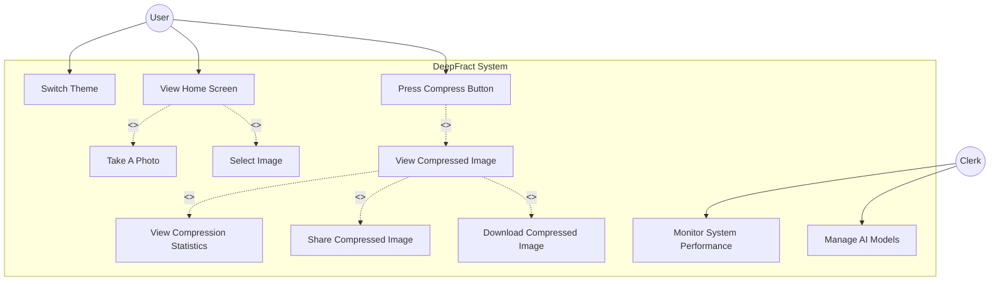

---

## Use Case Specifications

### UC-01: Switch Theme

| Attribute | Description |
|-----------|-------------|
| **Use Case ID** | UC-01 |
| **Name** | Switch Theme |
| **Actor** | User |
| **Preconditions** | User is authenticated and on any screen with theme access |
| **Postconditions** | Application theme is changed (Dark ↔ Light) |
| **Trigger** | User clicks on theme toggle switch |

#### Main Success Scenario
| Step | Actor | System |
|------|-------|--------|
| 1 | User navigates to Profile Screen | System displays profile with current theme setting |
| 2 | User toggles the Dark Mode switch | System captures current screen state |
| 3 | | System applies theme transition animation |
| 4 | | System updates theme in ThemeProvider |
| 5 | | System persists theme preference locally |
| 6 | | System refreshes UI with new theme |

#### Alternative Flows
- **A1:** Theme animation fails → System applies theme without animation

---

### UC-02: View Home Screen

| Attribute | Description |
|-----------|-------------|
| **Use Case ID** | UC-02 |
| **Name** | View Home Screen |
| **Actor** | User |
| **Preconditions** | User is authenticated |
| **Postconditions** | Home screen is displayed with upload options |
| **Trigger** | User completes authentication or navigates to home |

#### Main Success Scenario
| Step | Actor | System |
|------|-------|--------|
| 1 | User successfully logs in | System validates authentication |
| 2 | | System determines platform (Web/Mobile) |
| 3 | | System renders appropriate home screen layout |
| 4 | | System displays navigation options |
| 5 | | System shows image selection area |

#### Extensions
- **E1:** First-time user → System shows onboarding tutorial
- **E2:** Web platform → System shows WebHomeScreen with navbar

---

### UC-03: Take A Photo

| Attribute | Description |
|-----------|-------------|
| **Use Case ID** | UC-03 |
| **Name** | Take A Photo |
| **Actor** | User |
| **Preconditions** | User is on Home Screen, device has camera access |
| **Postconditions** | Photo is captured and ready for compression |
| **Trigger** | User selects camera option |

#### Main Success Scenario
| Step | Actor | System |
|------|-------|--------|
| 1 | User taps "Camera" option | System checks camera permission |
| 2 | | System opens device camera |
| 3 | User captures photo | System receives image data |
| 4 | User confirms photo | System stores image temporarily |
| 5 | | System displays image preview |
| 6 | | System enables "Compress" button |

#### Alternative Flows
- **A1:** Camera permission denied → System shows permission request dialog
- **A2:** User cancels capture → System returns to home screen
- **A3:** Camera unavailable (web) → System hides camera option

---

### UC-04: Select Image

| Attribute | Description |
|-----------|-------------|
| **Use Case ID** | UC-04 |
| **Name** | Select Image |
| **Actor** | User |
| **Preconditions** | User is on Home Screen |
| **Postconditions** | Image is selected and ready for compression |
| **Trigger** | User selects gallery option |

#### Main Success Scenario
| Step | Actor | System |
|------|-------|--------|
| 1 | User taps "Gallery" option | System opens image picker |
| 2 | User browses gallery | System displays available images |
| 3 | User selects an image | System validates image format |
| 4 | | System reads image bytes |
| 5 | | System displays image preview |
| 6 | | System enables "Compress" button |

#### Alternative Flows
- **A1:** Storage permission denied → System shows permission dialog
- **A2:** Invalid image format → System shows error message
- **A3:** User cancels selection → System returns to home screen

---

### UC-05: Press Compress Button

| Attribute | Description |
|-----------|-------------|
| **Use Case ID** | UC-05 |
| **Name** | Press Compress Button |
| **Actor** | User |
| **Preconditions** | Image is selected/captured |
| **Postconditions** | Image is compressed, results displayed |
| **Trigger** | User clicks compress button |

#### Main Success Scenario
| Step | Actor | System |
|------|-------|--------|
| 1 | User taps "Compress" button | System validates image is selected |
| 2 | | System shows loading overlay with animation |
| 3 | | System sends image to compression service |
| 4 | | CompressionService processes image |
| 5 | | System receives compressed result |
| 6 | | System calculates compression statistics |
| 7 | | System records transaction to Firestore |
| 8 | | System navigates to result screen (UC-06) |

#### Alternative Flows
- **A1:** Compression fails → System shows error dialog
- **A2:** Network error → System shows retry option
- **A3:** User cancels during compression → System aborts and returns

---

### UC-06: View Compressed Image

| Attribute | Description |
|-----------|-------------|
| **Use Case ID** | UC-06 |
| **Name** | View Compressed Image |
| **Actor** | User |
| **Preconditions** | Compression completed successfully |
| **Postconditions** | Compressed image is displayed with statistics |
| **Trigger** | Compression process completes (included by UC-05) |

#### Main Success Scenario
| Step | Actor | System |
|------|-------|--------|
| 1 | | System displays CompressionResultScreen |
| 2 | | System shows before/after image comparison |
| 3 | | System displays compression statistics (UC-07) |
| 4 | User can toggle between original/compressed | System updates image preview |
| 5 | | System shows action buttons (share, download, new) |

---

### UC-07: View Compression Statistics

| Attribute | Description |
|-----------|-------------|
| **Use Case ID** | UC-07 |
| **Name** | View Compression Statistics |
| **Actor** | User |
| **Preconditions** | Viewing compression result |
| **Postconditions** | Statistics are displayed |
| **Trigger** | Result screen is shown (included by UC-06) |

#### Main Success Scenario
| Step | Actor | System |
|------|-------|--------|
| 1 | | System calculates original file size |
| 2 | | System calculates compressed file size |
| 3 | | System calculates compression ratio |
| 4 | | System calculates compression time |
| 5 | | System displays all statistics in UI |

**Statistics Displayed:**
- Original Size (e.g., "10.5 MB")
- Compressed Size (e.g., "1.05 MB")
- Compression Ratio (e.g., "90.0%")
- Compression Time (e.g., "2.5 seconds")

---

### UC-08: Share Compressed Image

| Attribute | Description |
|-----------|-------------|
| **Use Case ID** | UC-08 |
| **Name** | Share Compressed Image |
| **Actor** | User |
| **Preconditions** | Compressed image is available |
| **Postconditions** | Image is shared via platform's share mechanism |
| **Trigger** | User taps share button |

#### Main Success Scenario
| Step | Actor | System |
|------|-------|--------|
| 1 | User taps "Share" button | System gets compressed image file |
| 2 | | System invokes platform share sheet |
| 3 | User selects sharing target | Platform handles sharing |
| 4 | | System shows success confirmation |

#### Alternative Flows
- **A1:** Web platform → System uses Web Share API or clipboard
- **A2:** Sharing fails → System shows error message

---

### UC-09: Download Compressed Image

| Attribute | Description |
|-----------|-------------|
| **Use Case ID** | UC-09 |
| **Name** | Download Compressed Image |
| **Actor** | User |
| **Preconditions** | Compressed image is available |
| **Postconditions** | Image is saved to device storage |
| **Trigger** | User taps download button |

#### Main Success Scenario
| Step | Actor | System |
|------|-------|--------|
| 1 | User taps "Download" button | System checks storage permission |
| 2 | | System generates unique filename |
| 3 | | System saves image to device storage |
| 4 | | System shows success snackbar |

#### Alternative Flows
- **A1:** Permission denied → System shows permission dialog
- **A2:** Storage full → System shows error message
- **A3:** Web platform → System triggers browser download

---

### UC-10: Monitor System Performance

| Attribute | Description |
|-----------|-------------|
| **Use Case ID** | UC-10 |
| **Name** | Monitor System Performance |
| **Actor** | Clerk (Admin) |
| **Preconditions** | Admin access to backend systems |
| **Postconditions** | Performance metrics are viewed |
| **Trigger** | Admin accesses monitoring dashboard |

#### Main Success Scenario
| Step | Actor | System |
|------|-------|--------|
| 1 | Admin accesses dashboard | System authenticates admin |
| 2 | | System retrieves performance metrics |
| 3 | | System displays: compression counts, success rates, avg times |
| 4 | Admin reviews metrics | System provides drill-down options |

---

### UC-11: Manage AI Models

| Attribute | Description |
|-----------|-------------|
| **Use Case ID** | UC-11 |
| **Name** | Manage AI Models |
| **Actor** | Clerk (Admin) |
| **Preconditions** | Admin access to AI backend |
| **Postconditions** | AI models are updated/configured |
| **Trigger** | Admin needs to update compression models |

#### Main Success Scenario
| Step | Actor | System |
|------|-------|--------|
| 1 | Admin accesses AI management | System shows available models |
| 2 | Admin uploads new model | System validates model format |
| 3 | | System deploys model to backend |
| 4 | | System updates model version |
| 5 | Admin configures parameters | System applies new configuration |

---

## Sequence Diagrams

### SD-01: User Authentication Sequence

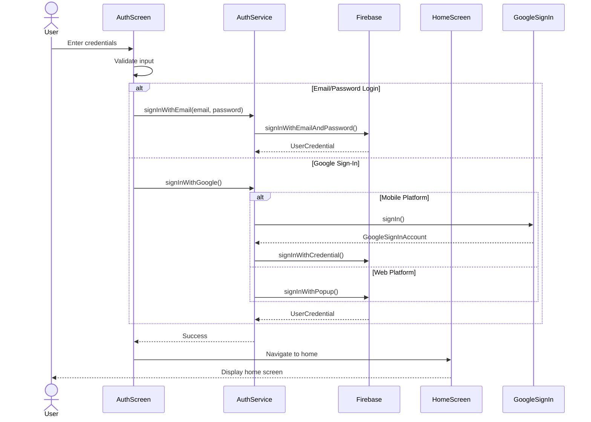

### SD-02: Image Selection and Compression Sequence

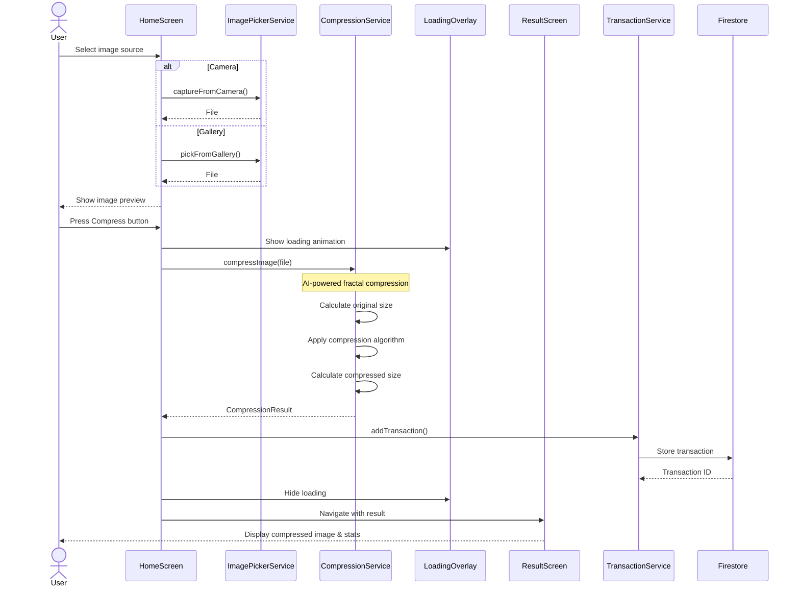

### SD-03: Theme Switch Sequence

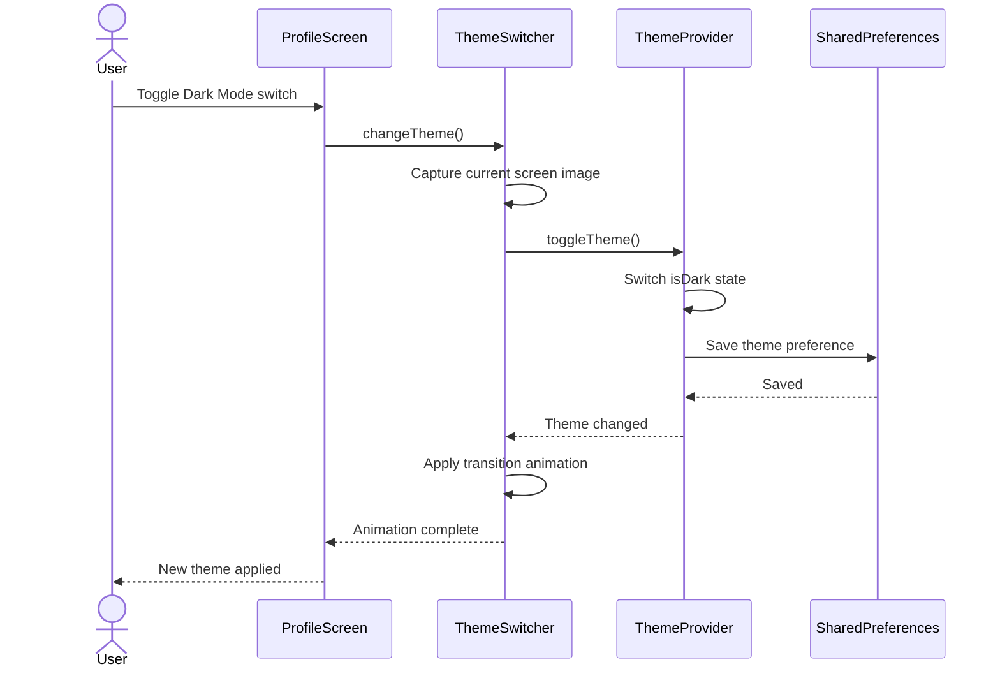

### SD-04: Share Compressed Image Sequence

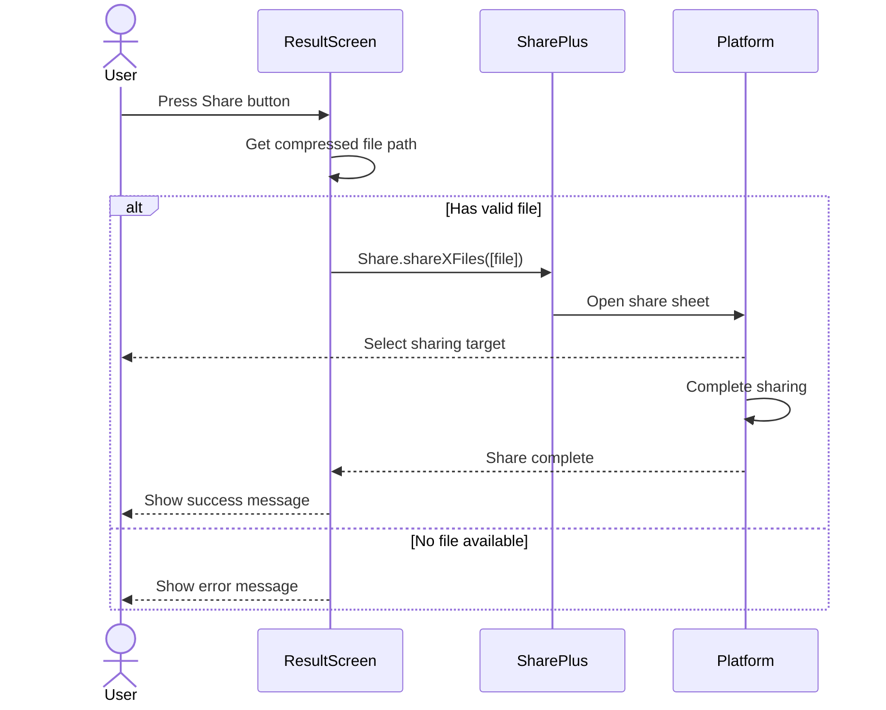

### SD-05: Download Compressed Image Sequence

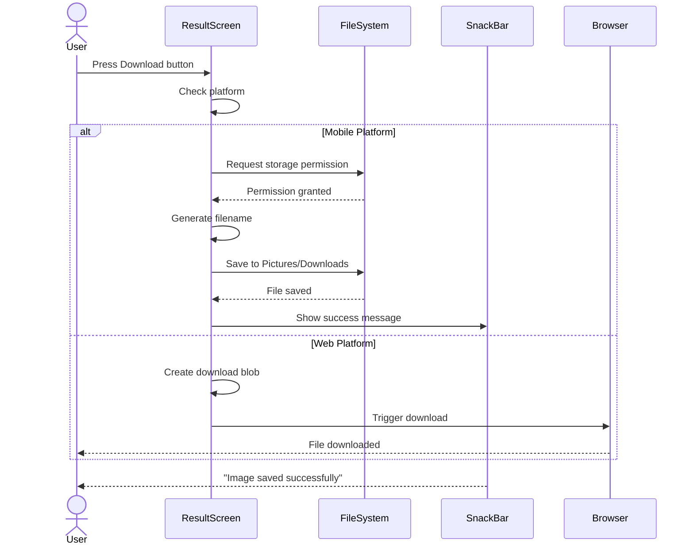

### SD-06: View Compression Statistics Sequence

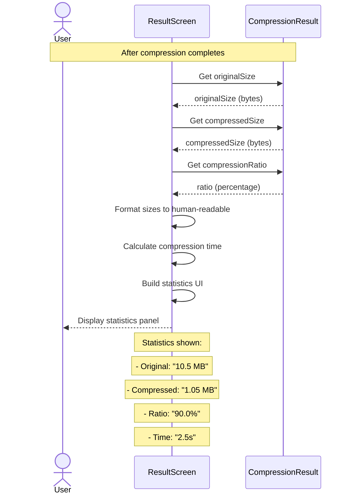

---

## Class Diagram

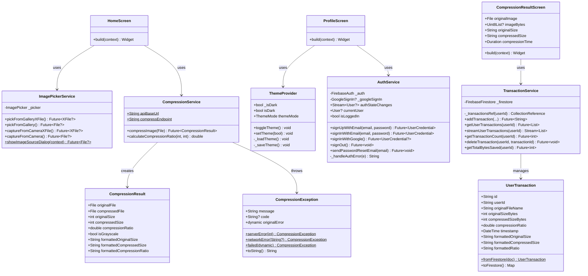

---

## Database Schema

### Firestore Database Structure

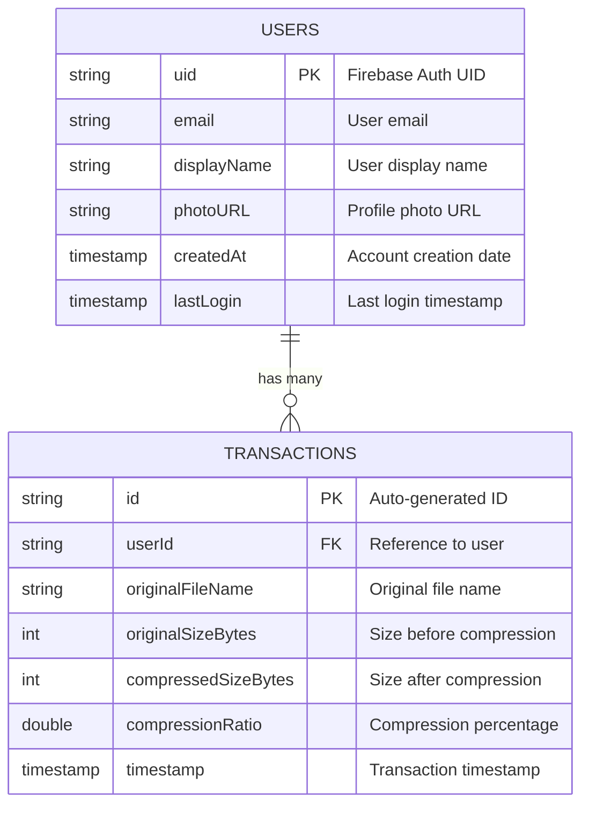

### Collection Structure

```
firestore/
├── users/
│   └── {userId}/
│       ├── email: string
│       ├── displayName: string
│       ├── photoURL: string
│       ├── createdAt: timestamp
│       ├── lastLogin: timestamp
│       └── transactions/
│           └── {transactionId}/
│               ├── userId: string
│               ├── originalFileName: string
│               ├── originalSizeBytes: int
│               ├── compressedSizeBytes: int
│               ├── compressionRatio: double
│               └── timestamp: timestamp
```

### Data Dictionary

| Collection | Field | Type | Description | Constraints |
|------------|-------|------|-------------|-------------|
| **users** | uid | string | Firebase Auth unique identifier | PK, Required |
| | email | string | User's email address | Required, Unique |
| | displayName | string | User's display name | Optional |
| | photoURL | string | URL to profile photo | Optional |
| | createdAt | timestamp | Account creation timestamp | Auto-set |
| | lastLogin | timestamp | Last login timestamp | Auto-update |
| **transactions** | id | string | Auto-generated document ID | PK, Auto |
| | userId | string | Reference to parent user | FK, Required |
| | originalFileName | string | Name of original file | Required |
| | originalSizeBytes | int | File size before compression | Required, >= 0 |
| | compressedSizeBytes | int | File size after compression | Required, >= 0 |
| | compressionRatio | double | Compression percentage | Required, 0-100 |
| | timestamp | timestamp | When compression occurred | Auto-set |

---

## Activity Diagrams

### AD-01: Complete Image Compression Flow

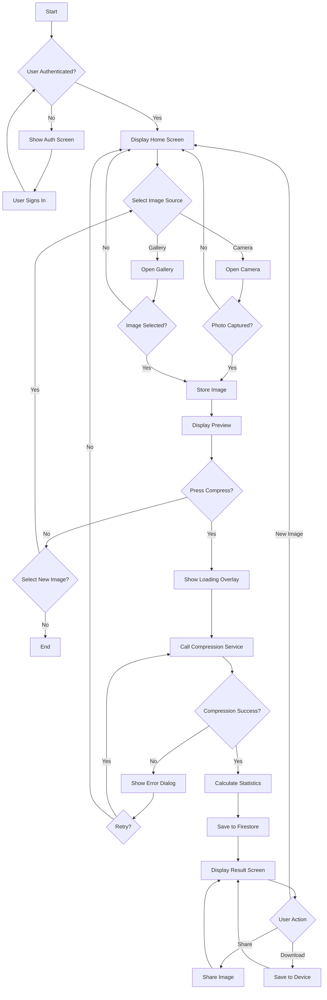

### AD-02: User Authentication Flow

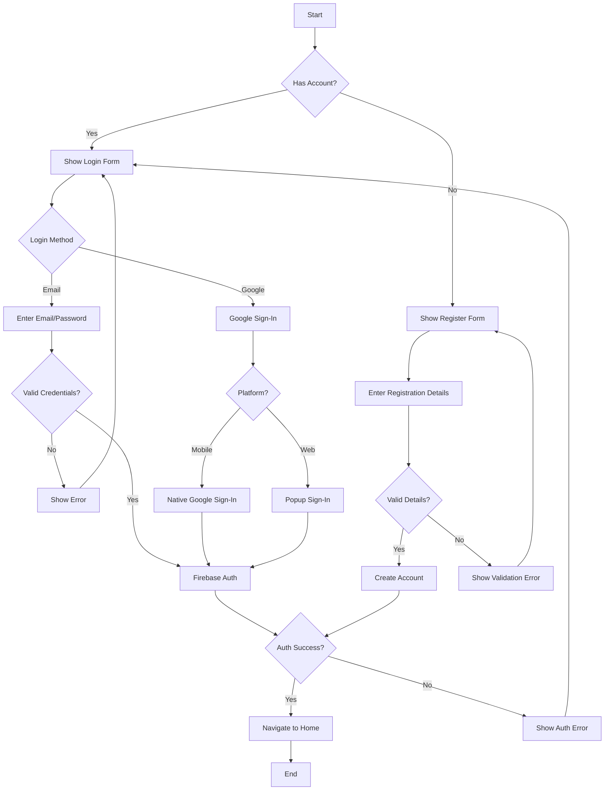

### AD-03: Theme Switching Flow

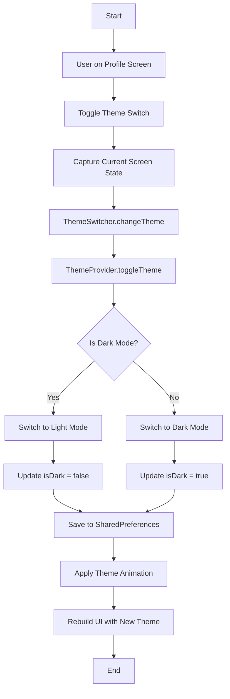

---

## Appendix

### Technology Stack

| Layer | Technology |
|-------|------------|
| **Frontend Framework** | Flutter 3.x |
| **State Management** | Provider |
| **Authentication** | Firebase Auth |
| **Database** | Cloud Firestore |
| **Storage** | Firebase Storage (planned) |
| **Image Processing** | AI Backend (Python/TensorFlow) |
| **File Sharing** | share_plus package |
| **Image Selection** | image_picker package |

### Project Structure

```
lib/
├── main.dart                    # App entry point
├── firebase_options.dart        # Firebase configuration
├── core/
│   ├── constants/              # App constants
│   └── errors/                 # Custom exceptions
├── models/
│   └── user_transaction.dart   # Transaction data model
├── screens/
│   ├── splash_screen.dart      # Initial loading screen
│   ├── onboarding_screen.dart  # First-time user tutorial
│   ├── auth_screen.dart        # Login/Register screen
│   ├── home_screen.dart        # Main home (mobile)
│   ├── web_home_screen.dart    # Main home (web)
│   ├── compression_result_screen.dart  # Results display
│   ├── profile_screen.dart     # User profile
│   └── about_screen.dart       # App information
├── services/
│   ├── auth_service.dart       # Authentication logic
│   ├── compression_service.dart # Compression logic
│   ├── image_picker_service.dart # Image selection
│   └── transaction_service.dart # Firestore operations
├── utils/
│   ├── constants.dart          # UI constants
│   ├── theme_provider.dart     # Theme management
│   ├── routes.dart             # App routing
│   └── file_size_extension.dart # Size formatting
└── widgets/
    ├── animated_background.dart # Background animations
    ├── theme_switcher.dart     # Theme transition
    ├── upload_modal.dart       # Image upload dialog
    ├── web_navbar.dart         # Web navigation
    └── ... (12 total widgets)
```

---

*Document generated by analyzing the DeepFract codebase - December 2024*
