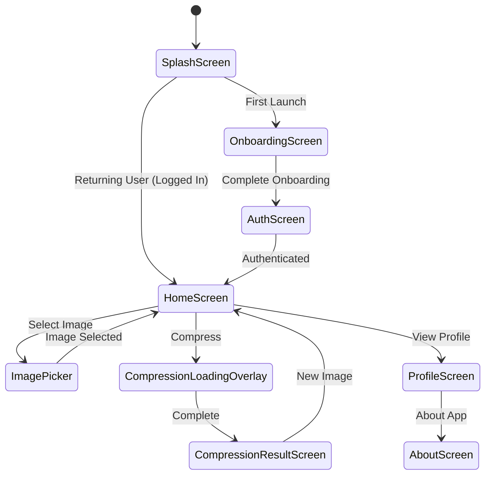

# DeepFract Codebase Deep Analysis

> **Project**: DeepFract - Fractal Image Compression using AI Techniques  
> **Type**: Flutter Cross-Platform Mobile Application  
> **Analysis Date**: December 2025

---

## Executive Summary

DeepFract is a **Flutter-based cross-platform mobile application** designed for AI-powered fractal image compression. The frontend implementation is complete with a modern, polished UI supporting both mobile and web platforms. The application features Firebase authentication, Cloud Firestore for transaction storage, and a mock compression service awaiting backend integration.

```mermaid
flowchart LR
    subgraph Frontend["🖥️ Frontend (Complete)"]
        A[Splash Screen] --> B[Onboarding]
        B --> C[Auth Screen]
        C --> D[Home Screen]
        D --> E[Compression Loading]
        E --> F[Results Screen]
    end
    subgraph Backend["🤖 Backend (Pending)"]
        G[AI Compression API]
    end
    subgraph Firebase["🔥 Firebase (Complete)"]
        H[Authentication]
        I[Firestore DB]
    end
    D --> G
    G --> E
    C --> H
    F --> I
```



---

## Project Architecture

### High-Level Structure

```
DeepFract-main-V3/
├── lib/                        # Main source code
│   ├── main.dart               # Application entry point
│   ├── firebase_options.dart   # Firebase configuration
│   ├── core/                   # Core utilities
│   │   ├── constants/          # App-wide duration constants
│   │   └── errors/             # Custom exception classes
│   ├── models/                 # Data models (1 model)
│   ├── screens/                # UI screens (8 screens)
│   ├── services/               # Business logic services (4 services)
│   ├── utils/                  # Utilities and configuration (5 files)
│   └── widgets/                # Reusable UI components (12 widgets)
├── assets/                     # Static assets (images)
├── docs/                       # Comprehensive documentation (33 files)
├── android/                    # Android platform configuration
├── ios/                        # iOS platform configuration
├── web/                        # Web platform configuration
├── windows/                    # Windows platform configuration
├── linux/                      # Linux platform configuration
├── macos/                      # macOS platform configuration
└── pubspec.yaml                # Dependencies and configuration
```

---

## Technology Stack

### Core Framework
| Component | Technology | Version |
|-----------|------------|---------|
| Framework | Flutter | SDK ^3.7.0 |
| Language | Dart | SDK ^3.7.0 |
| State Management | Provider | ^6.1.1 |
| Design System | Material Design 3 | Built-in |

### Dependencies

| Package | Version | Purpose |
|---------|---------|---------|
| `provider` | ^6.1.1 | State management for theme switching |
| `image_picker` | ^1.0.7 | Camera/gallery image selection |
| `shared_preferences` | ^2.2.2 | Local storage for preferences |
| `smooth_page_indicator` | ^1.1.0 | Onboarding page indicators |
| `share_plus` | ^7.2.1 | Share functionality |
| `path_provider` | ^2.1.1 | File path handling |
| `firebase_core` | ^4.2.1 | Firebase initialization |
| `firebase_auth` | ^6.1.2 | Authentication |
| `cloud_firestore` | ^6.1.0 | Database |
| `google_sign_in` | ^6.2.1 | Google OAuth |
| `cupertino_icons` | ^1.0.8 | iOS-style icons |

---

## Application Flow



---

## Core Components Analysis

### 1. Entry Point (`main.dart`)

The application initializes with:
- **Firebase Initialization**: Platform-specific Firebase configuration
- **System UI Configuration**: Transparent status/navigation bars, edge-to-edge mode
- **Provider Setup**: ThemeProvider for reactive theme management
- **Theme Switcher Wrapper**: Enables smooth theme transition animations

```dart
runApp(
  ChangeNotifierProvider(
    create: (_) => ThemeProvider(),
    child: const ThemeSwitcher(child: DeepFractApp()),
  ),
);
```

**Key Features**:
- Edge-to-edge display mode
- Material 3 design system
- Dual theme support (light/dark)
- Named route navigation
- Firebase integration

---

### 2. Routing System (`routes.dart`)

Six primary routes:
| Route | Path | Screen |
|-------|------|--------|
| Splash | `/` | SplashScreen |
| Onboarding | `/onboarding` | OnboardingScreen |
| Home | `/home` | HomeScreen |
| Auth | `/auth` | AuthScreen |
| Profile | `/profile` | ProfileScreen |
| About | `/about` | AboutScreen |

---

### 3. Screens Architecture

#### 3.1 Splash Screen (`splash_screen.dart`)
- **Lines**: 299
- **Purpose**: Branding display with animation
- **Features**:
  - Animated logo with scaling and rotation
  - Checks onboarding completion status
  - Auto-navigates after 2.5 seconds
  - Platform-aware (Web vs Mobile)

#### 3.2 Onboarding Screen (`onboarding_screen.dart`)
- **Lines**: 196
- **Purpose**: 3-page introduction flow
- **Pages**:
  1. **High Compression Power** - Explains compression capabilities
  2. **Lightning Fast AI** - AI-powered speed benefits
  3. **Simple & Powerful** - Upload functionality guide
- **Features**:
  - PageView with smooth animations
  - Skip button (pages 1-2)
  - Previous/Next navigation
  - Theme toggle in header
  - Persistent completion state via SharedPreferences

#### 3.3 Auth Screen (`auth_screen.dart`)
- **Lines**: 453
- **Purpose**: User authentication
- **Features**:
  - Email/Password login and signup
  - Google Sign-In (Native on mobile, Popup on web)
  - Password reset functionality
  - Form validation
  - Auto-redirect if already authenticated

#### 3.4 Home Screen (`home_screen.dart`)
- **Lines**: 307
- **Purpose**: Main image upload interface
- **Architecture**: Platform-adaptive
  - Mobile: `_MobileHomeScreen`
  - Web: `WebHomeScreen`
- **Features**:
  - Image selection (camera/gallery)
  - Modern header with gradient
  - Theme toggle
  - Compression workflow trigger

#### 3.5 Web Home Screen (`web_home_screen.dart`)
- **Lines**: 178
- **Purpose**: Web-optimized interface
- **Features**:
  - Animated background
  - Web navbar
  - Hero section with upload area
  - Tutorial overlay system
  - Drag-and-drop support

#### 3.6 Compression Result Screen (`compression_result_screen.dart`)
- **Lines**: 753 (largest screen)
- **Purpose**: Display compression results
- **Features**:
  - Original/Compressed toggle view
  - Statistics display (sizes, ratio, time)
  - Download functionality
  - Share functionality
  - New image upload option
  - Platform-adaptive layouts (Mobile/Web)

#### 3.7 Profile Screen (`profile_screen.dart`)
- **Lines**: 549
- **Purpose**: User profile and settings
- **Features**:
  - User avatar with photo/initials
  - Compression statistics
  - Theme switching
  - About section link
  - Sign out functionality

#### 3.8 About Screen (`about_screen.dart`)
- **Lines**: 458
- **Purpose**: App information
- **Features**:
  - Fractal compression explanation
  - AI technology details
  - Algorithm parameters
  - Modern card-based design

---

### 4. Services Layer

#### 4.1 Auth Service (`auth_service.dart`)

Firebase authentication wrapper:

| Method | Description |
|--------|-------------|
| `signUpWithEmail()` | Email/password registration |
| `signInWithEmail()` | Email/password login |
| `signInWithGoogle()` | Google OAuth (platform-adaptive) |
| `signOut()` | Clear session and sign out |
| `sendPasswordResetEmail()` | Password recovery |
| `authStateChanges` | Stream for auth state listening |

**Platform-Specific Behavior**:
```dart
if (kIsWeb) {
  // Web: Use popup authentication
  return await _auth.signInWithPopup(googleProvider);
} else {
  // Mobile: Use native Google Sign-In
  final GoogleSignInAccount? googleUser = await googleSignIn.signIn();
  // ...credential creation and Firebase sign-in
}
```

#### 4.2 Compression Service (`compression_service.dart`)

> [!IMPORTANT]
> This is the **primary backend integration point**. Currently uses mock data.

**Current Implementation**:
```dart
// Mock: Simulates 90% compression with 3-second delay
await Future.delayed(AppDurations.compressionSimulation);
final mockCompressedSize = (originalSize * 0.1).toInt();
```

**Backend Flow** (documented but not implemented):
1. Calculate original file size
2. Prepare multipart HTTP request
3. Send to `/api/compress` endpoint
4. Parse JSON response with base64 image
5. Save compressed file locally
6. Return CompressionResult

**CompressionResult Model**:
| Property | Type | Description |
|----------|------|-------------|
| `originalFile` | File | Source image |
| `compressedFile` | File | Compressed image |
| `originalSize` | int | Original bytes |
| `compressedSize` | int | Compressed bytes |
| `compressionRatio` | double | Percentage reduction |
| `isGrayscale` | bool | Grayscale conversion flag |

#### 4.3 Image Picker Service (`image_picker_service.dart`)

**Capabilities**:
- Gallery image selection
- Camera capture
- XFile support for web platform
- Bottom sheet source selector dialog
- 100% image quality preservation

#### 4.4 Transaction Service (`transaction_service.dart`)

Firestore integration for compression history:

**Firestore Schema**:
```
users/{userId}/transactions/{transactionId}
├── userId
├── originalFileName
├── originalSizeBytes
├── compressedSizeBytes
├── compressionRatio
└── timestamp
```

| Method | Description |
|--------|-------------|
| `addTransaction()` | Creates new compression record |
| `getUserTransactions()` | Fetches all user transactions |
| `streamUserTransactions()` | Real-time transaction updates |
| `getTransactionCount()` | Returns total compression count |
| `getTotalBytesSaved()` | Calculates cumulative bytes saved |

---

### 5. Models

#### UserTransaction (`user_transaction.dart`)

Represents a compression transaction:

```dart
class UserTransaction {
  final String id;
  final String userId;
  final String originalFileName;
  final int originalSizeBytes;
  final int compressedSizeBytes;
  final double compressionRatio;
  final DateTime timestamp;
}
```

**Features**:
- Firestore serialization/deserialization
- Human-readable size formatting
- Formatted ratio percentage

---

### 6. Theme System

#### 6.1 Theme Definition (`theme.dart`)

**Light Theme Palette**:
| Color | Hex | Usage |
|-------|-----|-------|
| Primary | `#2196F3` | Main accent |
| Secondary | `#64B5F6` | Light accent |
| Background | `#FFFFFF` | Screen background |
| Text Primary | `#212121` | Main text |
| Text Secondary | `#757575` | Subtle text |

**Dark Theme Palette**:
| Color | Hex | Usage |
|-------|-----|-------|
| Primary | `#42A5F5` | Lighter blue |
| Background | `#121212` | Dark background |
| Surface | `#1E1E1E` | Card surfaces |
| Text Primary | `#E0E0E0` | Light text |

**Design Tokens**:
- Material 3 enabled
- Zero elevation buttons
- 12px rounded corners
- Consistent 32px horizontal padding

#### 6.2 Theme Provider (`theme_provider.dart`)

**Features**:
- `ChangeNotifier` for reactive updates
- Persists theme preference via SharedPreferences
- Async loading with post-frame callback
- Safe disposal with `_mounted` flag

#### 6.3 Theme Switcher (`theme_switcher.dart`)

**Advanced Animation**:
- Captures screen as `ui.Image`
- Overlays frozen snapshot during transition
- 600ms fade-out animation
- Prevents visual jarring during theme change

---

### 7. Widget Components

#### UI Building Blocks

| Widget | Lines | Purpose |
|--------|-------|---------|
| OnboardingPage | 931 | Rich animated onboarding illustrations |
| CompressionLoadingOverlay | 499 | Processing animation with progress |
| HeroSection | 469 | Web homepage hero with stats |
| WebTutorialOverlay | 387 | Guided onboarding for web |
| UploadModal | 259 | Image source selection dialog |
| AnimatedBackground | 178 | Floating bubble particles |
| WebNavbar | 163 | Web navigation bar |
| PremiumButton | 149 | Animated gradient buttons |
| AnimatedThemeToggle | 129 | Sun/moon theme toggle |
| PremiumAlertDialog | 234 | Styled confirmation dialogs |
| ThemeSwitcher | 77 | Theme transition wrapper |
| CustomButton | 43 | Simple button wrapper |

#### Key Widget Highlights

**OnboardingPage** - Custom Illustrations:


**CompressionLoadingOverlay**:
- Animated rings/particles
- Progress percentage display
- Size comparison badges
- Completion callback

**AnimatedBackground**:
- 5 floating bubble particles
- Continuous animation loop
- Pulse effect with sine wave
- Theme-aware colors

---

### 8. Core Utilities

#### 8.1 App Durations (`app_durations.dart`)

Centralized timing constants:
| Constant | Duration | Usage |
|----------|----------|-------|
| `splashDelay` | 2500ms | Splash screen display |
| `compressionSimulation` | 3000ms | Mock compress time |
| `animationFast` | 150ms | Quick transitions |
| `animationMedium` | 300ms | Standard animations |
| `animationLong` | 500ms | Complex animations |
| `entranceAnimation` | 1000ms | Screen entrance |
| `rotationCycle` | 4000ms | Rotating elements |
| `particleAnimation` | 30000ms | Background particles |

#### 8.2 App Exceptions (`app_exceptions.dart`)

Exception hierarchy:
```
AppException (abstract)
├── ImagePickerException
│   ├── .cancelled()
│   ├── .permissionDenied()
│   └── .failed()
├── CompressionException
│   ├── .serverError()
│   ├── .networkError()
│   └── .failed()
└── FileException
    ├── .notFound()
    ├── .readError()
    └── .writeError()
```

#### 8.3 File Size Extension (`file_size_extension.dart`)

Converts bytes to human-readable format:
```dart
extension FileSizeFormatter on int {
  String toHumanReadableSize() {
    if (this < 1024) return '$this B';
    if (this < 1024 * 1024) return '${(this / 1024).toStringAsFixed(1)} KB';
    return '${(this / (1024 * 1024)).toStringAsFixed(1)} MB';
  }
}
```

#### 8.4 Constants (`constants.dart`)

App-wide string constants:
- App name and tagline
- Onboarding titles and descriptions
- Button labels
- SharedPreferences keys
- Asset paths

---

## Data Flow Diagrams

### Image Compression Flow


### Authentication Flow


### Theme Switching Flow


---

## Code Quality Assessment

### Strengths

| Aspect | Score | Notes |
|--------|-------|-------|
| Architecture | ⭐⭐⭐⭐ | Clean separation of concerns |
| Code Organization | ⭐⭐⭐⭐⭐ | Logical folder structure |
| UI/UX Design | ⭐⭐⭐⭐⭐ | Modern, polished animations |
| Documentation | ⭐⭐⭐⭐⭐ | 33 comprehensive docs |
| Cross-Platform | ⭐⭐⭐⭐ | Mobile + Web support |
| Error Handling | ⭐⭐⭐⭐ | Custom exception classes |
| Theme System | ⭐⭐⭐⭐⭐ | Smooth animated switching |
| Firebase Integration | ⭐⭐⭐⭐ | Auth + Firestore ready |

### Areas for Improvement

| Area | Priority | Recommendation |
|------|----------|----------------|
| Backend Integration | 🔴 High | Complete API implementation |
| Unit Tests | 🟡 Medium | Add widget and service tests |
| State Management | 🟢 Low | Consider BLoC for scalability |
| Offline Mode | 🟡 Medium | Add caching strategy |
| Accessibility | 🟡 Medium | Add semantic labels |

---

## Platform Support Matrix

| Platform | Status | Notes |
|----------|--------|-------|
| Android | ✅ Complete | Full permissions configured |
| iOS | ✅ Complete | Info.plist permissions set |
| Web | ✅ Complete | Adaptive UI with tutorial |
| Windows | ⚠️ Configured | Needs testing |
| macOS | ⚠️ Configured | Needs testing |
| Linux | ⚠️ Configured | Needs testing |

---

## Backend Integration Readiness

### API Contract (Expected)

**Endpoint**: `POST /api/compress`

**Request**:
```json
{
  "image": "<multipart-file>",
  "quality": "high",
  "algorithm": "fractal_ai"
}
```

**Response**:
```json
{
  "success": true,
  "compressed_image": "<base64>",
  "original_size": 10485760,
  "compressed_size": 1048576,
  "compression_ratio": 90.0,
  "is_grayscale": true,
  "processing_time_ms": 2500
}
```

### Integration Points

| File | Line | Change Required |
|------|------|-----------------|
| `compression_service.dart` | 18 | Replace `apiBaseUrl` |
| `compression_service.dart` | 34-111 | Uncomment real API call |
| `pubspec.yaml` | - | Add `http: ^1.1.0` |

---

## File Statistics

| Metric | Count |
|--------|-------|
| Total Dart Files | ~34 |
| Screens | 8 |
| Widgets | 12 |
| Services | 4 |
| Models | 1 |
| Utilities | 5 |
| Core Files | 2 |
| Documentation Files | 33 |
| Lines of Code | ~6,000+ |

---

## Conclusion

DeepFract demonstrates a **production-ready Flutter frontend** with:
- ✅ Modern Material 3 design
- ✅ Smooth animations and transitions
- ✅ Cross-platform support (Mobile + Web)
- ✅ Comprehensive theming system
- ✅ Well-structured codebase
- ✅ Firebase authentication integrated
- ✅ Firestore database ready
- ✅ Extensive documentation

**Next Steps**:
1. Implement backend AI compression API
2. Replace mock service with real HTTP calls
3. Add unit and integration tests
4. Performance optimization for large images
5. App store preparation (assets, metadata)

---

*Analysis generated December 2025*
