# DeepFract - Activity Diagram

## Fractal Image Compression Using AI Techniques

### Graduation Project - UML Documentation

---

## Mermaid Activity Diagram (Clean & Organized)

---

## PlantUML Activity Diagram (Professional)

---

## Simple Clean Version (Vertical Flow)

```mermaid
%%{init: {'theme': 'base'}}%%
flowchart TB
    Start((●))
    End((◉))

    Start --> Launch

    subgraph INIT["⚙️ INITIALIZATION"]
        Launch[Launch App] --> Theme[Load Theme]
        Theme --> Splash[Splash Screen]
    end

    Splash --> Platform{Platform?}

    Platform -->|Web| Home
    Platform -->|Mobile| Onboard

    subgraph ONBOARD["📱 ONBOARDING"]
        Onboard[Screen 1] --> Screen2[Screen 2]
        Screen2 --> Screen3[Screen 3]
    end

    Screen3 --> Home

    subgraph SELECT["🖼️ IMAGE SELECTION"]
        Home[Home Screen] --> Source{Source?}
        Source -->|Gallery| Gallery[Gallery]
        Source -->|Camera| Camera[Camera]
        Gallery --> Preview[Preview]
        Camera --> Preview
    end

    Preview --> Compress{Compress?}
    Compress -->|No| Home
    Compress -->|Yes| Loading

    subgraph PROCESS["🔄 COMPRESSION"]
        Loading[Loading] --> Backend[Backend Process]
        Backend --> Done[Complete]
    end

    Done --> Result

    subgraph RESULT["📊 RESULTS"]
        Result[Result Screen] --> Stats[Statistics]
        Stats --> Action{Action?}
    end

    Action -->|Download| Download[Save]
    Action -->|Share| Share[Share]
    Action -->|New| Home
    Action -->|Exit| End

    Download --> Action
    Share --> Action

    style Start fill:#000,stroke:#000
    style End fill:#000,stroke:#000
    style Platform fill:#FFE082,stroke:#000
    style Source fill:#FFE082,stroke:#000
    style Compress fill:#FFE082,stroke:#000
    style Action fill:#FFE082,stroke:#000
```

---

## How to Use in Draw.io

1. **Arrange → Insert → Advanced → Mermaid**
2. Paste the code
3. Click **Insert**

## Phase Colors

| Phase           | Color  | Hex     |
| --------------- | ------ | ------- |
| Initialization  | Blue   | #E3F2FD |
| Routing         | Orange | #FFF3E0 |
| Image Selection | Green  | #E8F5E9 |
| Compression     | Pink   | #FCE4EC |
| Results         | Purple | #F3E5F5 |
| Decisions       | Yellow | #FFFACD |
