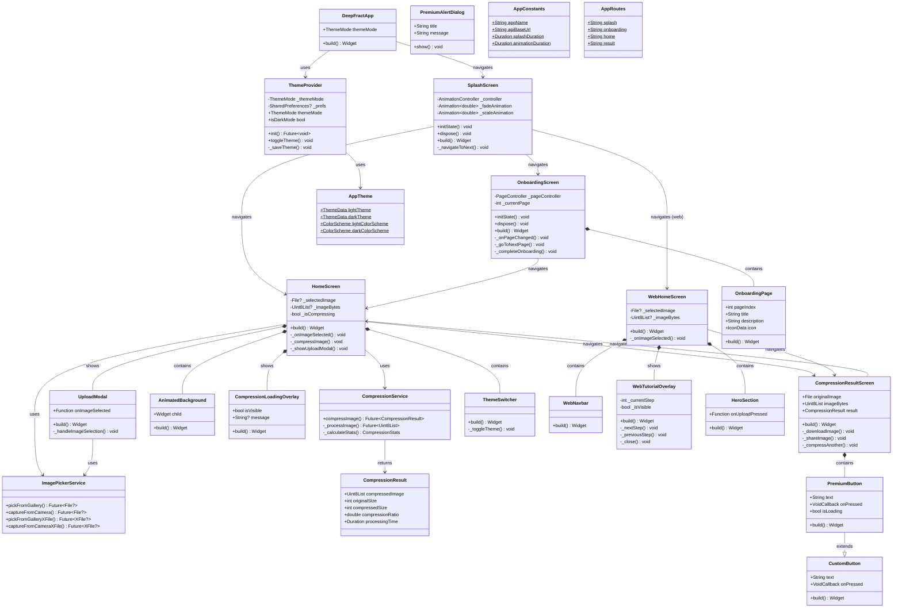

# DeepFract - Class Diagram

## Fractal Image Compression Application Using AI Techniques

### Graduation Project - UML Documentation

---

## Mermaid Class Diagram

---

## Class Categories

| Category      | Classes                                                                                                                                                                                | Count |
| ------------- | -------------------------------------------------------------------------------------------------------------------------------------------------------------------------------------- | ----- |
| **Screens**   | SplashScreen, OnboardingScreen, HomeScreen, WebHomeScreen, CompressionResultScreen                                                                                                     | 5     |
| **Services**  | ImagePickerService, CompressionService                                                                                                                                                 | 2     |
| **Providers** | ThemeProvider                                                                                                                                                                          | 1     |
| **Widgets**   | AnimatedBackground, CompressionLoadingOverlay, UploadModal, ThemeSwitcher, WebNavbar, WebTutorialOverlay, HeroSection, OnboardingPage, PremiumButton, CustomButton, PremiumAlertDialog | 11    |
| **Utils**     | AppTheme, AppConstants, AppRoutes                                                                                                                                                      | 3     |
| **Models**    | CompressionResult                                                                                                                                                                      | 1     |

---

## Relationship Types

| Symbol  | Meaning                |
| ------- | ---------------------- |
| `-->`   | Association (uses)     |
| `*--`   | Composition (contains) |
| `o--`   | Aggregation            |
| `--\|>` | Inheritance (extends)  |
| `..>`   | Dependency             |

---

## How to Use in Draw.io

1. **Arrange → Insert → Advanced → Mermaid**
2. Paste the code
3. Click **Insert**
