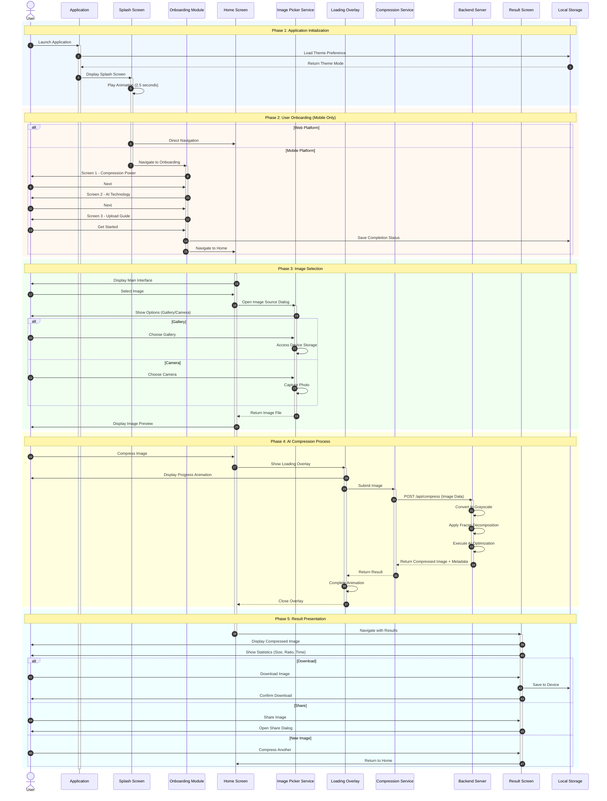

# DeepFract - Complete System Sequence Diagram

## Fractal Image Compression Using AI Techniques

### Graduation Project - UML Documentation

---

---

## Diagram Description

This sequence diagram illustrates the complete user journey through the **DeepFract** application, an AI-powered fractal image compression system. The diagram is divided into five distinct phases:

### Phase 1: Application Initialization

The system initializes by loading user preferences from local storage and displaying an animated splash screen for brand introduction.

### Phase 2: User Onboarding

Platform-specific routing directs mobile users through a three-screen onboarding tutorial explaining the application's capabilities, while web users proceed directly to the main interface.

### Phase 3: Image Selection

Users select images through a service that provides access to both the device gallery and camera, with the selected image displayed as a preview.

### Phase 4: AI Compression Process

The core functionality where the selected image is transmitted to the backend server for processing through the fractal compression algorithm enhanced with AI optimization techniques.

### Phase 5: Result Presentation

The compressed image is displayed alongside compression statistics, with options to download, share, or process additional images.

---

## Actors and Components

| Component                | Description                               |
| ------------------------ | ----------------------------------------- |
| **User**                 | End user interacting with the application |
| **Application**          | Main application controller               |
| **Splash Screen**        | Initial loading and branding display      |
| **Onboarding Module**    | User introduction tutorial                |
| **Home Screen**          | Primary user interface                    |
| **Image Picker Service** | Device image access service               |
| **Loading Overlay**      | Visual feedback during processing         |
| **Compression Service**  | Image compression handler                 |
| **Backend Server**       | AI-powered compression API                |
| **Result Screen**        | Compression results display               |
| **Local Storage**        | User preference persistence               |

---

## Key Interactions

1. **Steps 1-4**: System initialization and theme loading
2. **Steps 5-13**: Platform-aware onboarding flow
3. **Steps 14-20**: Image selection from device
4. **Steps 21-29**: Backend compression processing
5. **Steps 30-37**: Result display and user actions
