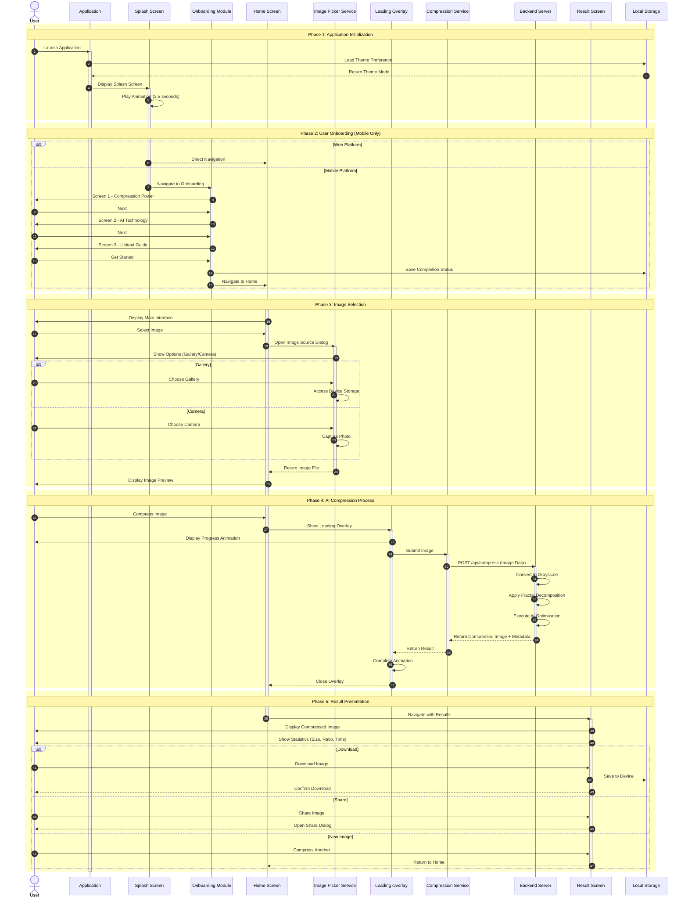

# DeepFract - Complete System Sequence Diagram (Mermaid)

## Fractal Image Compression Using AI Techniques

### Graduation Project - UML Documentation

---

## Mermaid Code (For Draw.io)

---

## Arrow Types

| Syntax | Type         | Usage             |
| ------ | ------------ | ----------------- |
| `->>`  | Solid arrow  | Request / Action  |
| `-->>` | Dashed arrow | Return / Response |

---

## Return Arrows (Dashed)

All return/response arrows now use `-->>`:

- `Storage-->>App: Return Theme Mode`
- `ImagePicker-->>Home: Return Image File`
- `Backend-->>Compression: Return Compressed Image + Metadata`
- `Compression-->>Loading: Return Result`
- `Loading-->>Home: Close Overlay`
- `Result-->>User: Confirm Download`
- `Result-->>User: Open Share Dialog`
- `Result-->>Home: Return to Home`

---

## Generate at:

**Draw.io: Arrange → Insert → Advanced → Mermaid**
