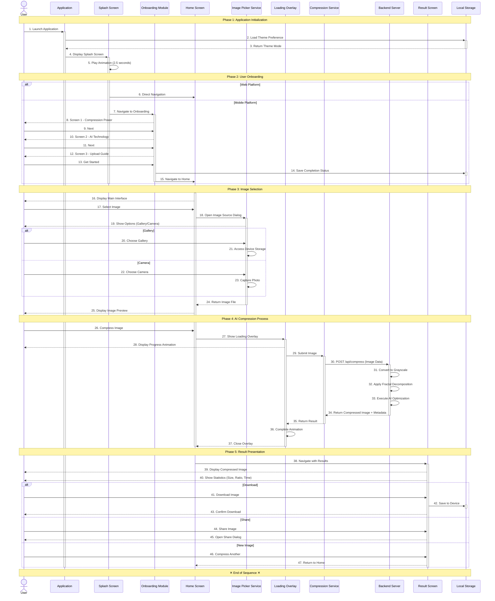
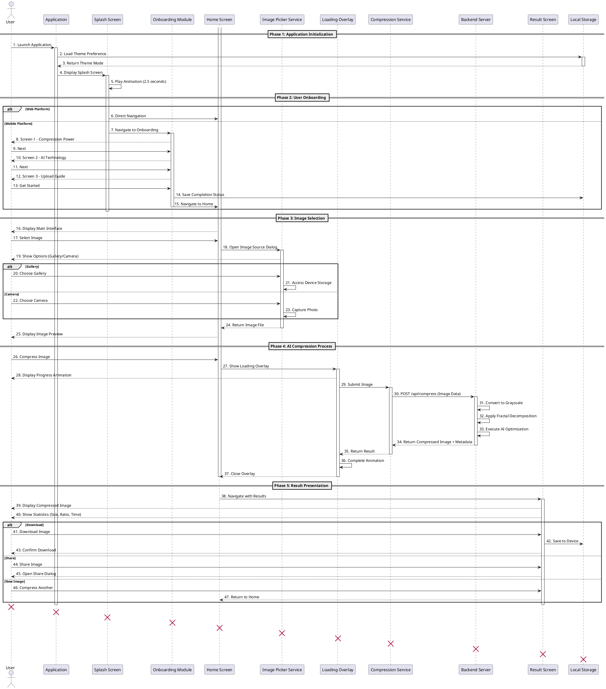

# DeepFract - Complete System Sequence Diagram (Mermaid)

## Fractal Image Compression Using AI Techniques

### Graduation Project - UML Documentation

---

## Mermaid Code (Note: X markers not supported in Mermaid)

---

## ⚠️ Mermaid Limitation

**Mermaid does NOT support X destruction markers** like PlantUML does.

For X markers, use **PlantUML** instead:

---

## PlantUML Version (With X Destruction Markers)

---

## Generate PlantUML at:

**http://www.plantuml.com/plantuml/uml/**

The PlantUML version will show the **X destruction markers** at the bottom of each lifeline.
