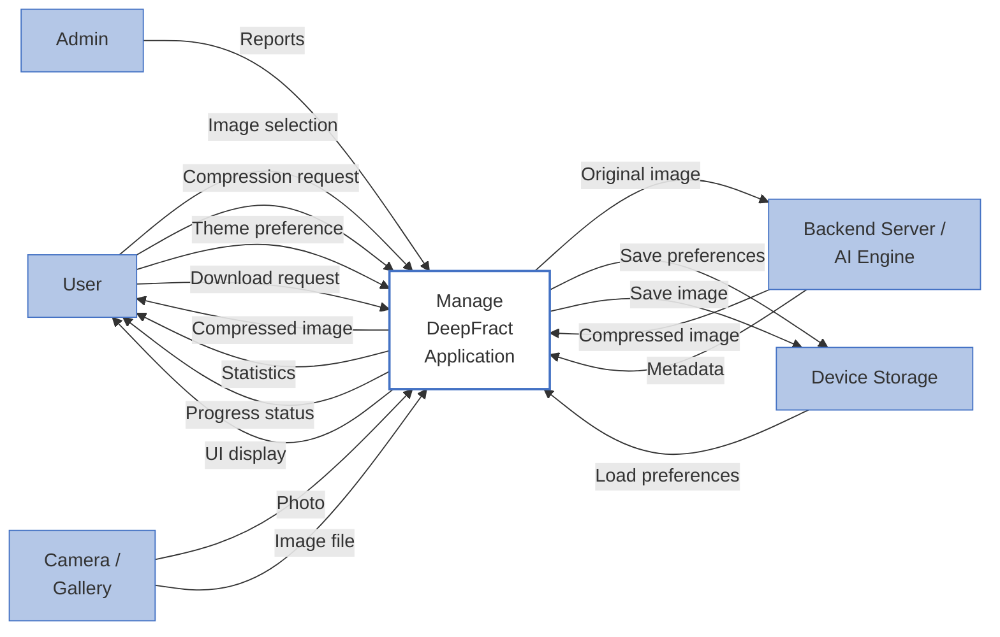

# DeepFract - Context Diagram

## Fractal Image Compression Application

---

## Mermaid Context Diagram (Matching Reference Format)

---

## Use in Draw.io:

**Arrange → Insert → Advanced → Mermaid**
