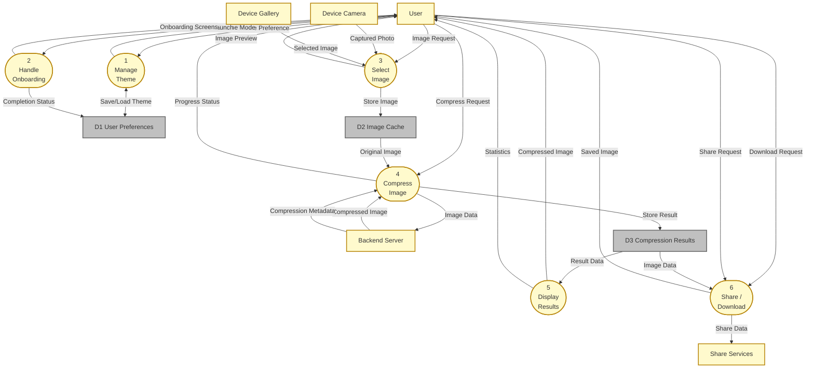

# DeepFract - Level 1 Data Flow Diagram

## Gane and Sarson Notation

### Fractal Image Compression Using AI Techniques

---

## System Description

- **System Name:** DeepFract - Fractal Image Compression System
- **External Entities:**
  - User (Mobile/Web)
  - Backend Server (AI Engine)
  - Device Camera
  - Device Gallery
  - Share Services
- **Key Processes:**
  - Process 1: Manage Theme
  - Process 2: Handle Onboarding
  - Process 3: Select Image
  - Process 4: Compress Image
  - Process 5: Display Results
  - Process 6: Share/Download Image
- **Key Data Stores:**
  - D1 User Preferences
  - D2 Image Cache
  - D3 Compression Results
- **Data Flows:**
  - Theme Preference, Image Selection, Compression Request, Result Display, Share Request

---

## Mermaid Level 1 DFD

---

## Component Summary

### External Entities (Yellow Rectangles)

| Entity         | Description                       |
| -------------- | --------------------------------- |
| User           | Mobile/Web application user       |
| Backend Server | AI compression engine             |
| Device Camera  | Hardware camera for photo capture |
| Device Gallery | Device image storage              |
| Share Services | External sharing platforms        |

### Processes (Yellow Rounded Rectangles)

| #   | Process           | Description                           |
| --- | ----------------- | ------------------------------------- |
| 1   | Manage Theme      | Handle light/dark theme switching     |
| 2   | Handle Onboarding | First-time user tutorial              |
| 3   | Select Image      | Image acquisition from camera/gallery |
| 4   | Compress Image    | AI fractal compression processing     |
| 5   | Display Results   | Show compressed image and statistics  |
| 6   | Share/Download    | Save or share compressed images       |

### Data Stores (Gray Rectangles)

| ID  | Store               | Description                    |
| --- | ------------------- | ------------------------------ |
| D1  | User Preferences    | Theme mode, onboarding status  |
| D2  | Image Cache         | Selected original images       |
| D3  | Compression Results | Compressed images and metadata |

---

## Data Flow Descriptions

| #   | Data Flow            | From    | To       | Description                   |
| --- | -------------------- | ------- | -------- | ----------------------------- |
| 1   | Theme Preference     | User    | P1       | Light/Dark mode selection     |
| 2   | Theme Mode           | P1      | User     | Applied theme display         |
| 3   | First Launch         | User    | P2       | Initial app launch trigger    |
| 4   | Onboarding Screens   | P2      | User     | Tutorial content display      |
| 5   | Image Request        | User    | P3       | Image selection trigger       |
| 6   | Captured Photo       | Camera  | P3       | Photo from device camera      |
| 7   | Selected Image       | Gallery | P3       | Image from device storage     |
| 8   | Image Preview        | P3      | User     | Display selected image        |
| 9   | Compress Request     | User    | P4       | Compression trigger           |
| 10  | Original Image       | D2      | P4       | Cached image for compression  |
| 11  | Image Data           | P4      | Backend  | Image sent for AI processing  |
| 12  | Compressed Image     | Backend | P4       | Fractal compressed result     |
| 13  | Compression Metadata | Backend | P4       | Size, ratio, time data        |
| 14  | Progress Status      | P4      | User     | Loading animation feedback    |
| 15  | Result Data          | D3      | P5       | Stored compression result     |
| 16  | Statistics           | P5      | User     | Compression metrics display   |
| 17  | Download Request     | User    | P6       | Save image trigger            |
| 18  | Share Request        | User    | P6       | Share image trigger           |
| 19  | Saved Image          | P6      | User     | Downloaded image confirmation |
| 20  | Share Data           | P6      | ShareSvc | Image sent to share platform  |

---

## DeepFract Level 1 DFD

---

## How to Use in Draw.io

1. **Arrange → Insert → Advanced → Mermaid**
2. Paste the Mermaid code above
3. Click **Insert**
