# DeepFract Complete Hierarchical Task Analysis

> **Version:** 1.0  
> **Date:** December 2024  
> **Project:** DeepFract - AI-Powered Fractal Image Compression

---

## Complete HTA Diagram (All System Tasks)

```mermaid
flowchart TB
    %% ========================================
    %% MAIN SYSTEM GOAL
    %% ========================================
    
    subgraph SYSTEM["DeepFract System - Complete HTA"]
        direction TB
        
        %% ========================================
        %% USER FLOW: IMAGE COMPRESSION
        %% ========================================
        
        subgraph USER_FLOW["User Flow: Compress an Image"]
            direction TB
            
            GOAL0["<b>0. Compress an Image Using DeepFract</b>"]
            PLAN0["<i>plan 0: do 1, then 2-3, when image selected do 4,<br/>when compression completes do 5, optionally do 6 or 7</i>"]
            
            GOAL0 --- PLAN0
            
            %% Level 1 Tasks
            T1["1. Authenticate"]
            T2["2. View Home Screen"]
            T3["3. Select Image"]
            T4["4. Press Compress Button"]
            T5["5. View Results"]
            T6["6. Share Image"]
            T7["7. Download Image"]
            
            PLAN0 --> T1
            PLAN0 --> T2
            PLAN0 --> T3
            PLAN0 --> T4
            PLAN0 --> T5
            PLAN0 --> T6
            PLAN0 --> T7
            
            %% Task 1: Authenticate - Sub-tasks
            subgraph AUTH["Task 1: Authenticate"]
                direction TB
                P1["<i>plan 1: 1.1-1.2-1.3<br/>if new user do 1.4</i>"]
                T11["1.1 Enter Email"]
                T12["1.2 Enter Password"]
                T13["1.3 Press Login Button"]
                T14["1.4 Sign Up"]
                
                P1 --> T11
                P1 --> T12
                P1 --> T13
                P1 --> T14
            end
            
            T1 --> AUTH
            
            %% Task 3: Select Image - Sub-tasks
            subgraph SELECT["Task 3: Select Image"]
                direction TB
                P3["<i>plan 3: do 3.1 or 3.2</i>"]
                T31["3.1 Take a Photo"]
                T32["3.2 Select from Gallery"]
                
                P3 --> T31
                P3 --> T32
                
                %% Task 3.1: Take Photo - Sub-tasks
                subgraph PHOTO["Task 3.1: Take a Photo"]
                    direction TB
                    P31["<i>plan 3.1: 3.1.1-3.1.2-3.1.3-3.1.4</i>"]
                    T311["3.1.1 Check Camera Permission"]
                    T312["3.1.2 Open Camera"]
                    T313["3.1.3 Capture Photo"]
                    T314["3.1.4 Confirm Photo"]
                    
                    P31 --> T311
                    P31 --> T312
                    P31 --> T313
                    P31 --> T314
                end
                
                T31 --> PHOTO
                
                %% Task 3.2: Select Gallery - Sub-tasks
                subgraph GALLERY["Task 3.2: Select from Gallery"]
                    direction TB
                    P32["<i>plan 3.2: 3.2.1-3.2.2-3.2.3</i>"]
                    T321["3.2.1 Check Storage Permission"]
                    T322["3.2.2 Open Image Picker"]
                    T323["3.2.3 Select Image File"]
                    
                    P32 --> T321
                    P32 --> T322
                    P32 --> T323
                end
                
                T32 --> GALLERY
            end
            
            T3 --> SELECT
            
            %% Task 4: Compress - Sub-tasks
            subgraph COMPRESS["Task 4: Press Compress Button"]
                direction TB
                P4["<i>plan 4: 4.1-4.2-4.3-4.4-4.5</i>"]
                T41["4.1 Validate Image Selected"]
                T42["4.2 Show Loading Animation"]
                T43["4.3 Send to Compression Service"]
                T44["4.4 Apply AI Fractal Algorithm"]
                T45["4.5 Save Transaction to Database"]
                
                P4 --> T41
                P4 --> T42
                P4 --> T43
                P4 --> T44
                P4 --> T45
            end
            
            T4 --> COMPRESS
            
            %% Task 5: View Results - Sub-tasks
            subgraph RESULTS["Task 5: View Results"]
                direction TB
                P5["<i>plan 5: 5.1-5.2-5.3, then 5.4</i>"]
                T51["5.1 Display Compressed Image"]
                T52["5.2 Show Before/After Comparison"]
                T53["5.3 View Compression Statistics"]
                T54["5.4 Show Action Buttons"]
                
                P5 --> T51
                P5 --> T52
                P5 --> T53
                P5 --> T54
            end
            
            T5 --> RESULTS
            
            %% Task 6: Share - Sub-tasks
            subgraph SHARE["Task 6: Share Image"]
                direction TB
                P6["<i>plan 6: 6.1-6.2-6.3</i>"]
                T61["6.1 Get Compressed File"]
                T62["6.2 Open Share Sheet"]
                T63["6.3 Select Sharing Target"]
                
                P6 --> T61
                P6 --> T62
                P6 --> T63
            end
            
            T6 --> SHARE
            
            %% Task 7: Download - Sub-tasks
            subgraph DOWNLOAD["Task 7: Download Image"]
                direction TB
                P7["<i>plan 7: 7.1-7.2-7.3-7.4</i>"]
                T71["7.1 Check Storage Permission"]
                T72["7.2 Generate Unique Filename"]
                T73["7.3 Save to Device Storage"]
                T74["7.4 Show Success Message"]
                
                P7 --> T71
                P7 --> T72
                P7 --> T73
                P7 --> T74
            end
            
            T7 --> DOWNLOAD
        end
        
        %% ========================================
        %% USER PREFERENCE: THEME SWITCH
        %% ========================================
        
        subgraph THEME_FLOW["User Preference: Theme Switch"]
            direction TB
            
            THEME0["<b>0. Switch Theme</b>"]
            THEME_PLAN["<i>plan 0: do 1, then 2-3-4,<br/>after animation do 5</i>"]
            
            THEME0 --- THEME_PLAN
            
            TH1["1. Navigate to Profile"]
            TH2["2. Toggle Theme Switch"]
            TH3["3. Update Theme Provider"]
            TH4["4. Apply Transition Animation"]
            TH5["5. Save to Local Storage"]
            
            THEME_PLAN --> TH1
            THEME_PLAN --> TH2
            THEME_PLAN --> TH3
            THEME_PLAN --> TH4
            THEME_PLAN --> TH5
        end
        
        %% ========================================
        %% ADMIN FLOW: SYSTEM MANAGEMENT
        %% ========================================
        
        subgraph ADMIN_FLOW["Admin Flow: Manage System"]
            direction TB
            
            ADMIN0["<b>0. Manage DeepFract System</b>"]
            ADMIN_PLAN["<i>plan 0: do 1 or 2</i>"]
            
            ADMIN0 --- ADMIN_PLAN
            
            %% Admin Task 1: Monitor Performance
            subgraph MONITOR["Task 1: Monitor System Performance"]
                direction TB
                AM_P1["<i>plan 1: 1.1-1.2-1.3</i>"]
                AM11["1.1 Access Admin Panel"]
                AM12["1.2 Query Aggregated Metrics"]
                AM13["1.3 Display Performance Dashboard"]
                
                AM_P1 --> AM11
                AM_P1 --> AM12
                AM_P1 --> AM13
            end
            
            %% Admin Task 2: Manage AI Models
            subgraph MODELS["Task 2: Manage AI Models"]
                direction TB
                AM_P2["<i>plan 2: 2.1-2.2-2.3</i>"]
                AM21["2.1 Upload New Model"]
                AM22["2.2 Validate Model Format"]
                AM23["2.3 Deploy Model to Backend"]
                
                AM_P2 --> AM21
                AM_P2 --> AM22
                AM_P2 --> AM23
            end
            
            AM1["1. Monitor System Performance"]
            AM2["2. Manage AI Models"]
            
            ADMIN_PLAN --> AM1
            ADMIN_PLAN --> AM2
            
            AM1 --> MONITOR
            AM2 --> MODELS
        end
    end
    
    %% ========================================
    %% STYLING
    %% ========================================
    
    classDef goalNode fill:#4a90d9,stroke:#2563eb,stroke-width:3px,color:#fff
    classDef planNode fill:#fef3c7,stroke:#f59e0b,stroke-width:2px,color:#92400e,font-style:italic
    classDef level1Node fill:#d1fae5,stroke:#10b981,stroke-width:2px,color:#065f46
    classDef level2Node fill:#e0e7ff,stroke:#6366f1,stroke-width:2px,color:#3730a3
    classDef level3Node fill:#fce7f3,stroke:#ec4899,stroke-width:2px,color:#9d174d
    classDef adminNode fill:#fee2e2,stroke:#ef4444,stroke-width:2px,color:#991b1b
    classDef themeNode fill:#f3e8ff,stroke:#a855f7,stroke-width:2px,color:#6b21a8
    
    class GOAL0,THEME0,ADMIN0 goalNode
    class PLAN0,P1,P3,P31,P32,P4,P5,P6,P7,THEME_PLAN,ADMIN_PLAN,AM_P1,AM_P2 planNode
    class T1,T2,T3,T4,T5,T6,T7 level1Node
    class T11,T12,T13,T14,T31,T32,T41,T42,T43,T44,T45,T51,T52,T53,T54,T61,T62,T63,T71,T72,T73,T74 level2Node
    class T311,T312,T313,T314,T321,T322,T323 level3Node
    class AM1,AM2,AM11,AM12,AM13,AM21,AM22,AM23 adminNode
    class TH1,TH2,TH3,TH4,TH5 themeNode
```

---

## Legend

| Color | Meaning |
|-------|---------|
| 🔵 **Blue** | Main Goal/Task (Level 0) |
| 🟡 **Yellow** | Plan descriptions |
| 🟢 **Green** | Level 1 sub-tasks |
| 🟣 **Purple** | Level 2 sub-tasks |
| 🌸 **Pink** | Level 3 sub-tasks |
| 🔴 **Red** | Admin tasks |
| 💜 **Light Purple** | Theme preference tasks |

---

## Plan Notation Reference

| Symbol | Meaning |
|--------|---------|
| **X - Y - Z** | Execute X, then Y, then Z in sequence |
| **X or Y** | Choose either X or Y (alternative paths) |
| **if [condition] do X** | Conditional execution of X |
| **when [event] do X** | Event-triggered execution |
| **optionally do X** | Optional task (user choice) |
| **then X** | Execute X after previous tasks complete |

---

*Document generated from DeepFract System Analysis*
