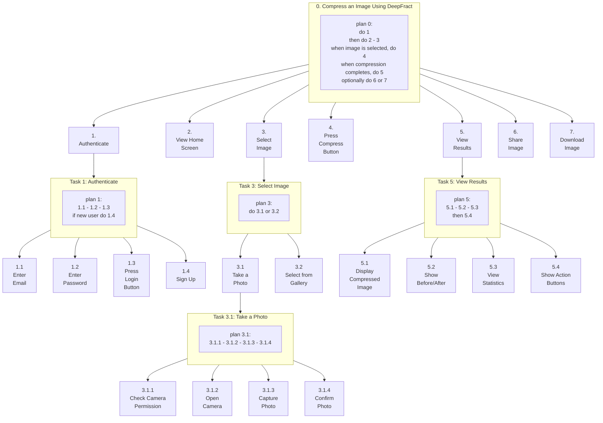
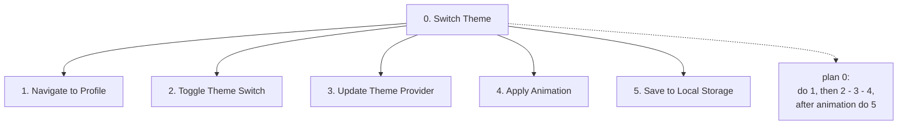
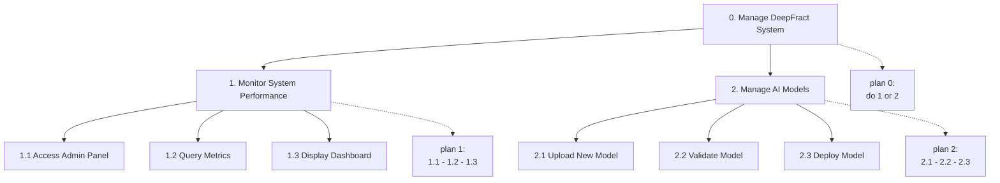
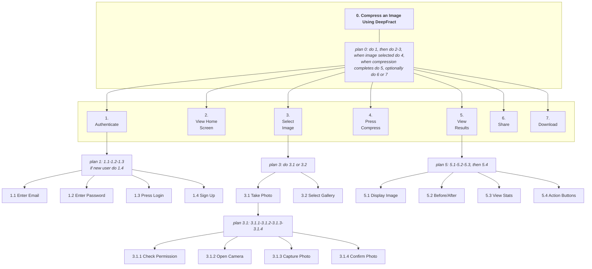

# Hierarchical Task Analysis (HTA) - DeepFract System

> **Version:** 1.0  
> **Date:** December 2024  
> **Project:** DeepFract - AI-Powered Fractal Image Compression

---

## Main Goal: Compress an Image Using DeepFract

```
┌─────────────────────────────────────────────────────────────────────────────────────────────────────────────────────┐
│                                                                                                                     │
│                                         ┌─────────────────────┐                                                     │
│                                         │     0.             │                                                     │
│                                         │  Compress an Image  │                                                     │
│                                         │  Using DeepFract    │                                                     │
│                                         └─────────┬───────────┘                                                     │
│                                                   │                                                                 │
│                                                   │  plan 0:                                                        │
│                                                   │  do 1                                                           │
│                                                   │  then do 2 - 3                                                  │
│                                                   │  when image is selected, do 4                                   │
│                                                   │  when compression completes, do 5                               │
│                                                   │  optionally do 6 or 7                                           │
│                                                   │                                                                 │
│     ┌───────────────┬─────────────────┬───────────┴───────────┬─────────────────┬─────────────────┬─────────────────┤
│     │               │                 │                       │                 │                 │                 │
│ ┌───┴───┐     ┌─────┴─────┐     ┌─────┴─────┐           ┌─────┴─────┐     ┌─────┴─────┐     ┌─────┴─────┐     ┌─────┴─────┐
│ │  1.   │     │    2.     │     │    3.     │           │    4.     │     │    5.     │     │    6.     │     │    7.     │
│ │Authent│     │  View     │     │  Select   │           │  Press    │     │  View     │     │  Share    │     │ Download  │
│ │ icate │     │   Home    │     │  Image    │           │ Compress  │     │ Results   │     │  Image    │     │   Image   │
│ │       │     │  Screen   │     │           │           │  Button   │     │           │     │           │     │           │
│ └───┬───┘     └───────────┘     └─────┬─────┘           └───────────┘     └─────┬─────┘     └───────────┘     └───────────┘
│     │                                 │                                         │                                         │
│     │  plan 1:                        │  plan 3:                                │  plan 5:                                │
│     │  1.1 - 1.2 - 1.3                │  do 3.1 or 3.2                          │  5.1 - 5.2 - 5.3                        │
│     │  if new user do 1.4             │                                         │  then 5.4                               │
│     │                                 │                                         │                                         │
│ ┌───┴────┬─────────┬─────────┬────────┤                                   ┌─────┴─────┬─────────┬─────────┬─────────────┐
│ │        │         │         │        │                                   │           │         │         │             │
│┌┴──────┐┌┴───────┐┌┴───────┐┌┴──────┐┌┴───────┐ ┌───────┐               ┌─┴─────────┐┌┴───────┐┌┴───────┐┌┴───────────┐ │
││ 1.1   ││  1.2   ││  1.3   ││ 1.4   ││  3.1   │ │  3.2  │               │   5.1     ││  5.2   ││  5.3   ││    5.4     │ │
││ Enter ││ Enter  ││ Press  ││ Sign  ││ Take a │ │Select │               │  Display  ││ Show   ││ View   ││  Show      │ │
││ Email ││Password││ Login  ││  Up   ││  Photo │ │ from  │               │Compressed ││Before/ ││Stats   ││  Action    │ │
││       ││        ││ Button ││       ││        │ │Gallery│               │  Image    ││ After  ││        ││  Buttons   │ │
│└───────┘└────────┘└────────┘└───────┘└───┬────┘ └───┬───┘               └───────────┘└────────┘└────────┘└────────────┘ │
│                                          │         │                                                                    │
│                                          │  plan 3.1:                                                                   │
│                                          │  3.1.1 - 3.1.2 - 3.1.3 - 3.1.4                                               │
│                                          │                                                                              │
│                            ┌─────────────┼─────────────┬───────────────┐                                                │
│                            │             │             │               │                                                │
│                      ┌─────┴─────┐ ┌─────┴─────┐ ┌─────┴─────┐ ┌───────┴─────┐                                          │
│                      │   3.1.1   │ │   3.1.2   │ │   3.1.3   │ │    3.1.4    │                                          │
│                      │   Check   │ │   Open    │ │  Capture  │ │   Confirm   │                                          │
│                      │ Camera    │ │  Camera   │ │   Photo   │ │   Photo     │                                          │
│                      │Permission │ │           │ │           │ │             │                                          │
│                      └───────────┘ └───────────┘ └───────────┘ └─────────────┘                                          │
│                                                                                                                         │
└─────────────────────────────────────────────────────────────────────────────────────────────────────────────────────────┘
```

---

## Mermaid Diagram: Main Image Compression Flow



---

## Mermaid Diagram: Complete HTA Tree Structure

```mermaid
flowchart TD
    R["0. Compress an Image<br/>Using DeepFract"]
    
    R --> A["1. Authenticate"]
    R --> B["2. View Home Screen"]
    R --> C["3. Select Image"]
    R --> D["4. Press Compress Button"]
    R --> E["5. View Results"]
    R --> F["6. Share Image"]
    R --> G["7. Download Image"]
    
    A --> A1["1.1 Enter Email"]
    A --> A2["1.2 Enter Password"]
    A --> A3["1.3 Press Login Button"]
    A --> A4["1.4 Sign Up"]
    
    C --> C1["3.1 Take a Photo"]
    C --> C2["3.2 Select from Gallery"]
    
    C1 --> C11["3.1.1 Check Camera Permission"]
    C1 --> C12["3.1.2 Open Camera"]
    C1 --> C13["3.1.3 Capture Photo"]
    C1 --> C14["3.1.4 Confirm Photo"]
    
    C2 --> C21["3.2.1 Check Storage Permission"]
    C2 --> C22["3.2.2 Open Image Picker"]
    C2 --> C23["3.2.3 Select Image File"]
    
    D --> D1["4.1 Validate Image Selected"]
    D --> D2["4.2 Show Loading Animation"]
    D --> D3["4.3 Send to Compression Service"]
    D --> D4["4.4 Apply AI Fractal Algorithm"]
    D --> D5["4.5 Save Transaction to Database"]
    
    E --> E1["5.1 Display Compressed Image"]
    E --> E2["5.2 Show Before/After Comparison"]
    E --> E3["5.3 View Compression Statistics"]
    E --> E4["5.4 Show Action Buttons"]
    
    F --> F1["6.1 Get Compressed File"]
    F --> F2["6.2 Open Share Sheet"]
    F --> F3["6.3 Select Sharing Target"]
    
    G --> G1["7.1 Check Storage Permission"]
    G --> G2["7.2 Generate Unique Filename"]
    G --> G3["7.3 Save to Device Storage"]
    G --> G4["7.4 Show Success Message"]
```



---

## Mermaid Diagram: Theme Switch



---

## Mermaid Diagram: Admin Tasks



---

## Mermaid Diagram: HTA with Plans (Academic Format)



---

## Task Breakdown Table

### Level 0: Main Goal

| Task ID | Task Name | Description |
|---------|-----------|-------------|
| **0** | Compress an Image Using DeepFract | Main goal of the system - user wants to compress an image using AI-powered fractal compression |

**Plan 0:**
- do 1
- then do 2 - 3
- when image is selected, do 4
- when compression completes, do 5
- optionally do 6 or 7

---

### Level 1: Main Sub-tasks

| Task ID | Task Name | Description |
|---------|-----------|-------------|
| **1** | Authenticate | User logs into the system using email/password or Google Sign-In |
| **2** | View Home Screen | System displays the main interface with image selection options |
| **3** | Select Image | User selects an image for compression (camera or gallery) |
| **4** | Press Compress Button | User initiates the AI-powered fractal compression process |
| **5** | View Results | System displays compression results and statistics |
| **6** | Share Image | User shares the compressed image (optional) |
| **7** | Download Image | User downloads the compressed image to device (optional) |

---

### Level 2: Sub-task Breakdowns

#### Task 1: Authenticate

**Plan 1:** 1.1 - 1.2 - 1.3; if new user do 1.4

| Task ID | Task Name | Description |
|---------|-----------|-------------|
| **1.1** | Enter Email | User enters email address in the login form |
| **1.2** | Enter Password | User enters password (masked input) |
| **1.3** | Press Login Button | User submits credentials for verification |
| **1.4** | Sign Up | New user creates an account (alternative flow) |

---

#### Task 3: Select Image

**Plan 3:** do 3.1 or 3.2

| Task ID | Task Name | Description |
|---------|-----------|-------------|
| **3.1** | Take a Photo | User captures image using device camera |
| **3.2** | Select from Gallery | User picks an existing image from device gallery |

---

#### Task 3.1: Take a Photo

**Plan 3.1:** 3.1.1 - 3.1.2 - 3.1.3 - 3.1.4

| Task ID | Task Name | Description |
|---------|-----------|-------------|
| **3.1.1** | Check Camera Permission | System verifies camera access permission |
| **3.1.2** | Open Camera | System opens the native camera interface |
| **3.1.3** | Capture Photo | User takes the photo |
| **3.1.4** | Confirm Photo | User confirms or retakes the captured photo |

---

#### Task 5: View Results

**Plan 5:** 5.1 - 5.2 - 5.3; then 5.4

| Task ID | Task Name | Description |
|---------|-----------|-------------|
| **5.1** | Display Compressed Image | System shows the compressed image in the viewer |
| **5.2** | Show Before/After | System displays comparison between original and compressed |
| **5.3** | View Statistics | System shows compression ratio, sizes, and time |
| **5.4** | Show Action Buttons | System displays Share, Download, and New Compression options |

---

## Complete HTA Diagram (Text Format)

```
0. Compress an Image Using DeepFract
│
├── plan 0: do 1, then do 2-3, when image selected do 4,
│           when compression completes do 5, optionally do 6 or 7
│
├── 1. Authenticate
│   │
│   ├── plan 1: 1.1 - 1.2 - 1.3; if new user do 1.4
│   │
│   ├── 1.1 Enter Email
│   ├── 1.2 Enter Password
│   ├── 1.3 Press Login Button
│   └── 1.4 Sign Up (alternative)
│
├── 2. View Home Screen
│
├── 3. Select Image
│   │
│   ├── plan 3: do 3.1 or 3.2
│   │
│   ├── 3.1 Take a Photo
│   │   │
│   │   ├── plan 3.1: 3.1.1 - 3.1.2 - 3.1.3 - 3.1.4
│   │   │
│   │   ├── 3.1.1 Check Camera Permission
│   │   ├── 3.1.2 Open Camera
│   │   ├── 3.1.3 Capture Photo
│   │   └── 3.1.4 Confirm Photo
│   │
│   └── 3.2 Select from Gallery
│       │
│       ├── plan 3.2: 3.2.1 - 3.2.2 - 3.2.3
│       │
│       ├── 3.2.1 Check Storage Permission
│       ├── 3.2.2 Open Image Picker
│       └── 3.2.3 Select Image File
│
├── 4. Press Compress Button
│   │
│   ├── plan 4: 4.1 - 4.2 - 4.3 - 4.4 - 4.5
│   │
│   ├── 4.1 Validate Image Selected
│   ├── 4.2 Show Loading Animation
│   ├── 4.3 Send to Compression Service
│   ├── 4.4 Apply AI Fractal Algorithm
│   └── 4.5 Save Transaction to Database
│
├── 5. View Results
│   │
│   ├── plan 5: 5.1 - 5.2 - 5.3; then 5.4
│   │
│   ├── 5.1 Display Compressed Image
│   ├── 5.2 Show Before/After Comparison
│   ├── 5.3 View Compression Statistics
│   └── 5.4 Show Action Buttons
│
├── 6. Share Image (optional)
│   │
│   ├── plan 6: 6.1 - 6.2 - 6.3
│   │
│   ├── 6.1 Get Compressed File
│   ├── 6.2 Open Share Sheet
│   └── 6.3 Select Sharing Target
│
└── 7. Download Image (optional)
    │
    ├── plan 7: 7.1 - 7.2 - 7.3 - 7.4
    │
    ├── 7.1 Check Storage Permission
    ├── 7.2 Generate Unique Filename
    ├── 7.3 Save to Device Storage
    └── 7.4 Show Success Message
```

---

## Additional HTA: Theme Switch

```
┌───────────────────────────────────────────────────────────────────────────────────────┐
│                                                                                       │
│                              ┌─────────────────────┐                                  │
│                              │        0.           │                                  │
│                              │   Switch Theme      │                                  │
│                              └─────────┬───────────┘                                  │
│                                        │                                              │
│                                        │  plan 0:                                     │
│                                        │  do 1                                        │
│                                        │  then 2 - 3 - 4                              │
│                                        │  after animation do 5                        │
│                                        │                                              │
│     ┌─────────────┬────────────────────┼────────────────────┬─────────────────────┐   │
│     │             │                    │                    │                     │   │
│ ┌───┴───┐   ┌─────┴─────┐        ┌─────┴─────┐        ┌─────┴─────┐         ┌─────┴───┐
│ │  1.   │   │    2.     │        │    3.     │        │    4.     │         │    5.   │
│ │Navigate│   │  Toggle   │        │  Update   │        │  Apply    │         │  Save   │
│ │ to     │   │  Theme    │        │  Theme    │        │  Animate  │         │ to Local│
│ │Profile │   │  Switch   │        │  Provider │        │           │         │ Storage │
│ └────────┘   └───────────┘        └───────────┘        └───────────┘         └─────────┘
│                                                                                       │
└───────────────────────────────────────────────────────────────────────────────────────┘
```

---

## Additional HTA: Admin Tasks

```
┌───────────────────────────────────────────────────────────────────────────────────────┐
│                                                                                       │
│                              ┌─────────────────────┐                                  │
│                              │        0.           │                                  │
│                              │  Manage DeepFract   │                                  │
│                              │      System         │                                  │
│                              └─────────┬───────────┘                                  │
│                                        │                                              │
│                                        │  plan 0:                                     │
│                                        │  do 1 or 2                                   │
│                                        │                                              │
│                    ┌───────────────────┴───────────────────┐                          │
│                    │                                       │                          │
│              ┌─────┴─────┐                           ┌─────┴─────┐                    │
│              │    1.     │                           │    2.     │                    │
│              │  Monitor  │                           │  Manage   │                    │
│              │  System   │                           │    AI     │                    │
│              │Performance│                           │  Models   │                    │
│              └─────┬─────┘                           └─────┬─────┘                    │
│                    │                                       │                          │
│                    │  plan 1:                              │  plan 2:                 │
│                    │  1.1 - 1.2 - 1.3                      │  2.1 - 2.2 - 2.3         │
│                    │                                       │                          │
│     ┌──────────────┼──────────────┐         ┌──────────────┼──────────────┐          │
│     │              │              │         │              │              │          │
│ ┌───┴───┐    ┌─────┴─────┐  ┌─────┴─────┐  ┌┴──────────┐ ┌─┴────────┐ ┌───┴─────┐   │
│ │ 1.1   │    │   1.2     │  │   1.3     │  │   2.1     │ │   2.2    │ │   2.3   │   │
│ │Access │    │  Query    │  │ Display   │  │  Upload   │ │ Validate │ │ Deploy  │   │
│ │ Admin │    │ Metrics   │  │ Dashboard │  │   New     │ │  Model   │ │  Model  │   │
│ │ Panel │    │           │  │           │  │  Model    │ │          │ │         │   │
│ └───────┘    └───────────┘  └───────────┘  └───────────┘ └──────────┘ └─────────┘   │
│                                                                                       │
└───────────────────────────────────────────────────────────────────────────────────────┘
```

---

## Legend

| Symbol | Meaning |
|--------|---------|
| **plan X:** | Describes the sequence/order of executing sub-tasks |
| **X.Y** | Sub-task Y of task X |
| **do X** | Execute task X |
| **then X** | Execute X after previous task |
| **X - Y** | Execute X then Y in sequence |
| **X or Y** | Choose either X or Y (alternative) |
| **if [condition] do X** | Conditional execution |
| **optionally do X** | Optional task execution |
| **when [event] do X** | Event-triggered execution |

---

*Document generated based on DeepFract System Analysis and Use Case Specifications*
