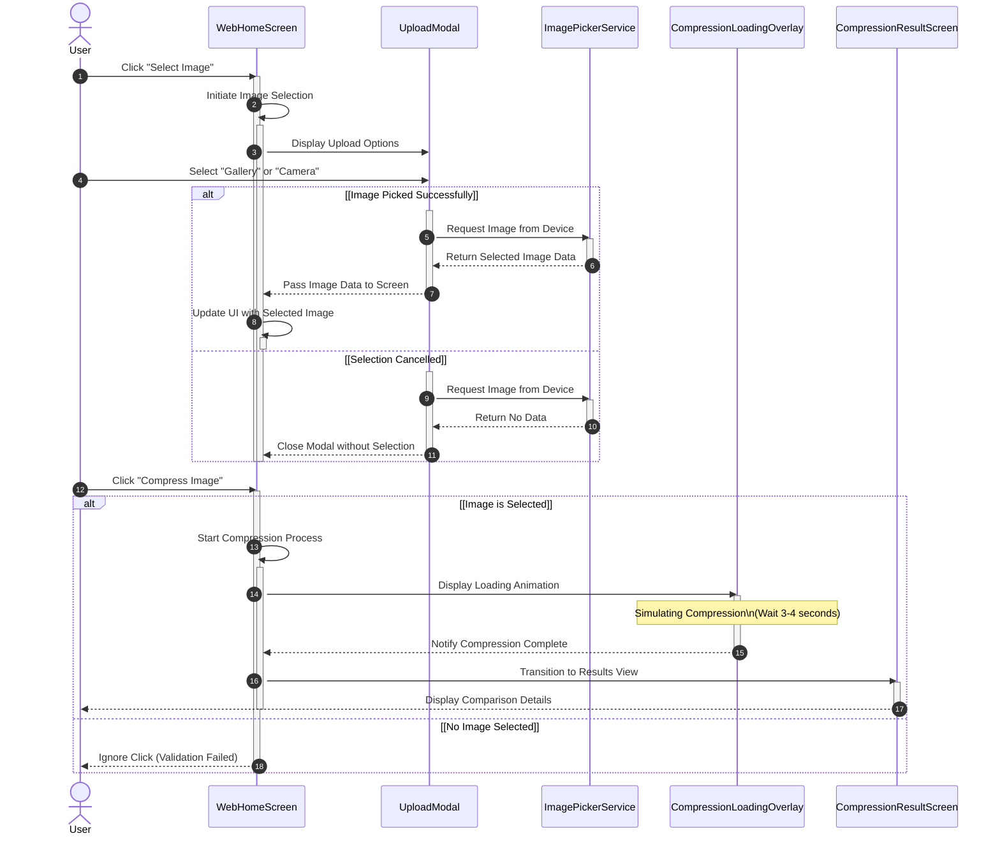

```mermaid
sequenceDiagram
    autonumber
    actor User
    participant Home as WebHomeScreen
    participant Modal as UploadModal
    participant Service as ImagePickerService
    participant Overlay as CompressionLoadingOverlay
    participant Result as CompressionResultScreen

    User->>Home: Click "Select Image"
    activate Home

    Home->>Home: Initiate Image Selection
    activate Home

    Home->>Modal: Display Upload Options

    User->>Modal: Select "Gallery" or "Camera"

    alt [Image Picked Successfully]
        activate Modal
        Modal->>Service: Request Image from Device
        activate Service
        Service-->>Modal: Return Selected Image Data
        deactivate Service

        Modal-->>Home: Pass Image Data to Screen
        deactivate Modal

        Home->>Home: Update UI with Selected Image
        activate Home
        deactivate Home

    else [Selection Cancelled]
        activate Modal
        Modal->>Service: Request Image from Device
        activate Service
        Service-->>Modal: Return No Data
        deactivate Service

        Modal-->>Home: Close Modal without Selection
        deactivate Modal
    end

    deactivate Home
    deactivate Home

    User->>Home: Click "Compress Image"
    activate Home

    alt [Image is Selected]
        Home->>Home: Start Compression Process
        activate Home

        Home->>Overlay: Display Loading Animation
        activate Overlay

        Note over Overlay: Simulating Compression\n(Wait 3-4 seconds)

        Overlay-->>Home: Notify Compression Complete
        deactivate Overlay

        Home->>Result: Transition to Results View
        activate Result

        Result-->>User: Display Comparison Details
        deactivate Result

        deactivate Home
    else [No Image Selected]
        Home-->>User: Ignore Click (Validation Failed)
    end

    deactivate Home
```
