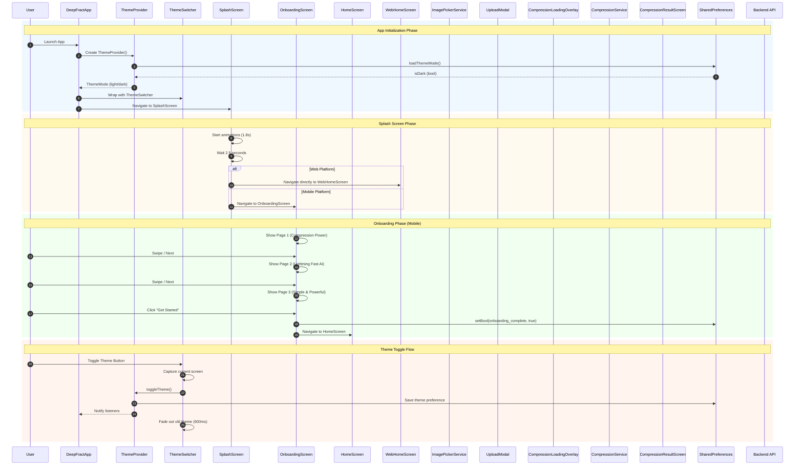
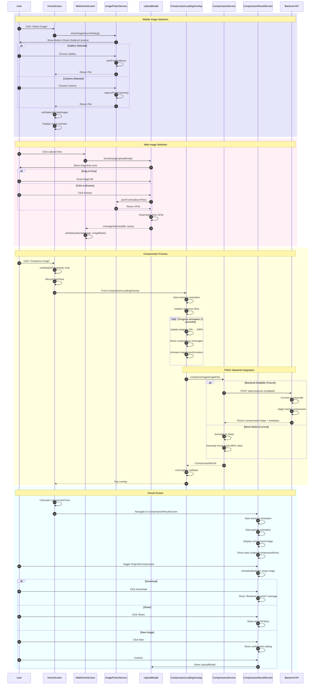
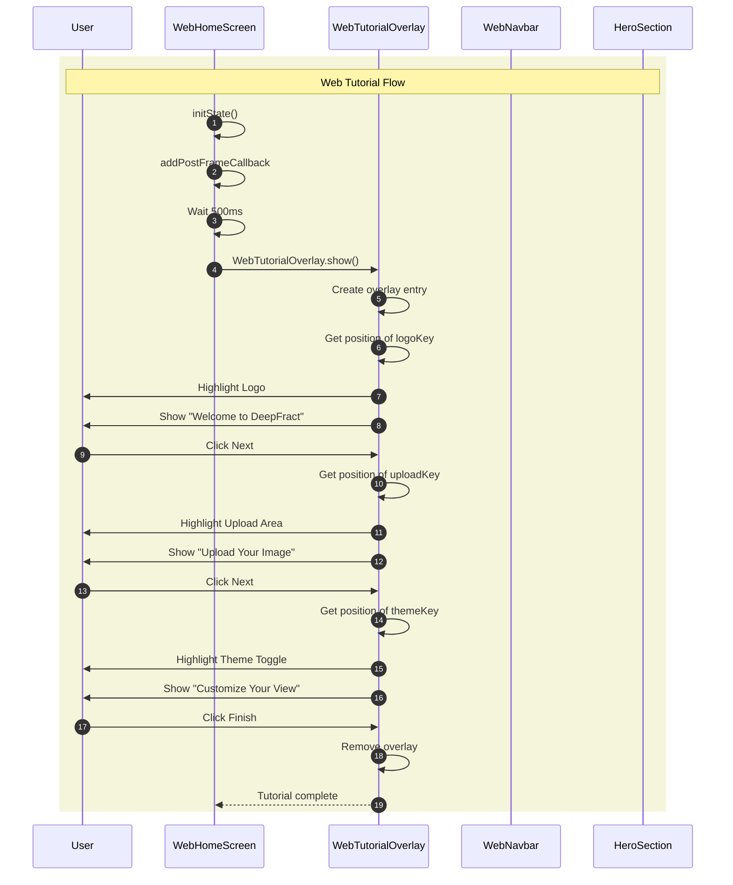
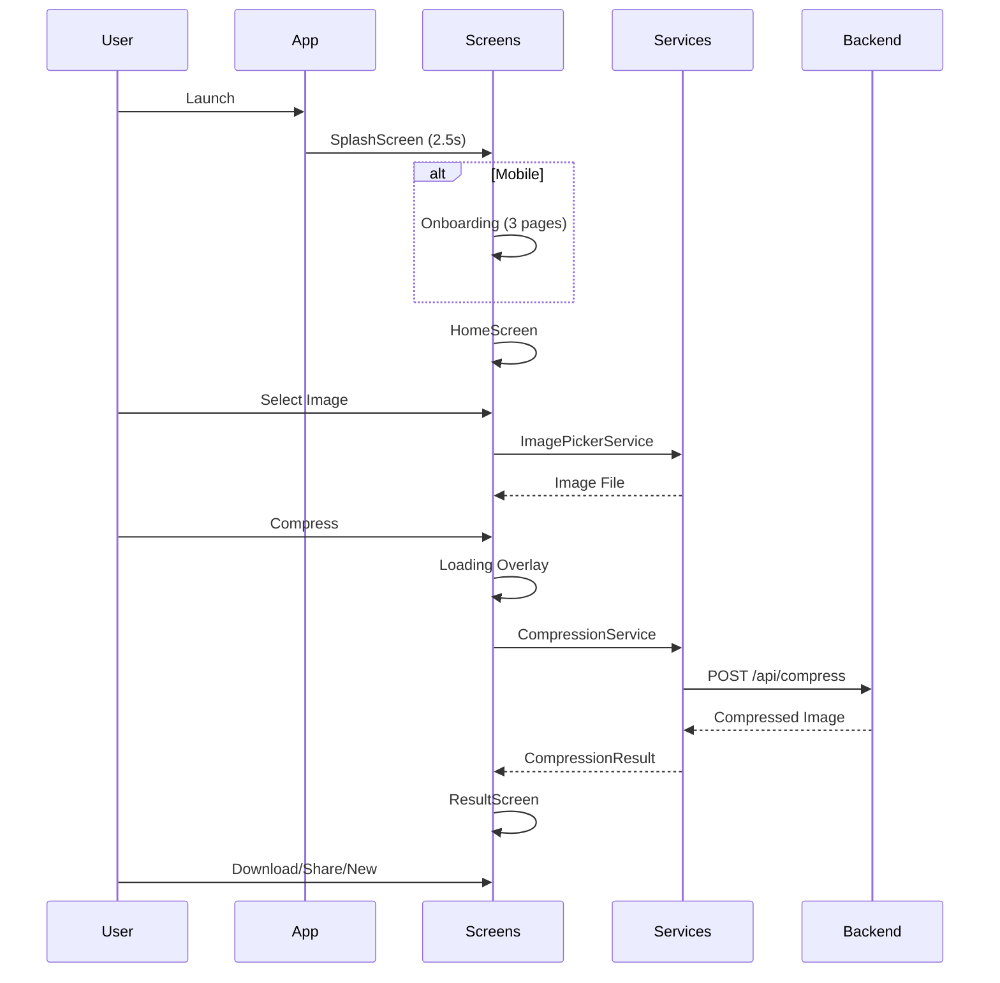

# DeepFract Sequence Diagrams for Draw.io

## How to Use in Draw.io

1. Go to [draw.io](https://app.diagrams.net/)
2. Click **Arrange → Insert → Advanced → Mermaid**
3. Paste the diagram code below
4. Click **Insert**

---

## 1. Complete Application Flow Sequence Diagram

---

## 2. Image Compression Flow Sequence Diagram

---

## 3. Web Tutorial Flow Sequence Diagram

---

## 4. Simplified Overview Diagram

---

## Notes for Draw.io

### Color Codes Used:

- **Light Blue** `rgb(240, 248, 255)` - App Initialization
- **Light Orange** `rgb(255, 250, 240)` - Splash Screen
- **Light Green** `rgb(240, 255, 240)` - Onboarding
- **Peach** `rgb(255, 245, 238)` - Theme Toggle
- **Lavender** `rgb(230, 230, 250)` - Mobile Image Selection
- **Pink** `rgb(255, 240, 245)` - Web Image Selection
- **Light Yellow** `rgb(255, 255, 224)` - Compression Process
- **Cyan** `rgb(240, 255, 255)` - Result Screen
- **Beige** `rgb(245, 245, 220)` - Tutorial Flow

### Participants (Actors):

| Abbreviation | Full Name                 | Role                      |
| ------------ | ------------------------- | ------------------------- |
| U            | User                      | End user of the app       |
| App          | DeepFractApp              | Main application widget   |
| TP           | ThemeProvider             | State manager for theme   |
| TS           | ThemeSwitcher             | Smooth theme transition   |
| SS           | SplashScreen              | Initial loading screen    |
| OS           | OnboardingScreen          | 3-page intro (mobile)     |
| HS           | HomeScreen                | Mobile home screen        |
| WHS          | WebHomeScreen             | Web home screen           |
| IPS          | ImagePickerService        | Image selection service   |
| UM           | UploadModal               | Web upload dialog         |
| CLO          | CompressionLoadingOverlay | Loading animation         |
| CS           | CompressionService        | Compression logic         |
| CRS          | CompressionResultScreen   | Results display           |
| SP           | SharedPreferences         | Local storage             |
| Backend      | Backend API               | Future server integration |
