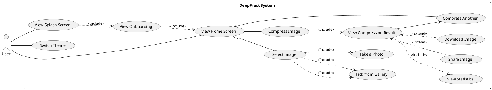

```plantuml
@startuml
left to right direction
skinparam packageStyle rectangle
actor User as user

package "DeepFract System" {
  usecase "View Splash Screen" as view_splash
  usecase "View Onboarding" as view_onboarding
  usecase "View Home Screen" as view_home
  usecase "Switch Theme" as switch_theme

  usecase "Select Image" as select_image
  usecase "Pick from Gallery" as pick_gallery
  usecase "Take a Photo" as take_photo

  usecase "Compress Image" as compress_image
  usecase "View Compression Result" as view_result

  usecase "View Statistics" as view_stats
  usecase "Share Image" as share_image
  usecase "Download Image" as download_image
  usecase "Compress Another" as compress_another
}

' Navigation
user -- view_splash
view_splash ..> view_onboarding : <<Include>>
view_onboarding ..> view_home : <<Include>>

' Home Actions
user -- view_home
user -- switch_theme

' Selection
view_home <|-- select_image
select_image ..> pick_gallery : <<Include>>
select_image ..> pick_gallery : <<Include>>
select_image ..> take_photo : <<Include>>

' Compression
view_home -- compress_image
compress_image ..> view_result : <<Include>>

' Result View
view_result ..> view_stats : <<Include>>
view_result <.. share_image : <<Extend>>
view_result <.. download_image : <<Extend>>
view_result --> compress_another
compress_another --> view_home

@enduml
```
