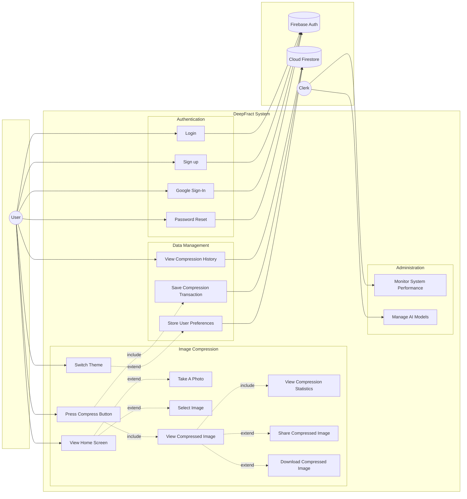

# Use Case Diagram - Required Changes to Match System

> **Objective**: Align the current Use Case Diagram with the complete DeepFract system  
> **Standard**: UML 2.0 Academic Standards  
> **Date**: December 2024

---

## Current vs. Required Comparison

### Current Diagram Analysis

Your current diagram includes:

| Actor | Use Cases |
|-------|-----------|
| **User** | Login, Sign up, Switch Theme, View Home Screen, Take A Photo, Select Image, Press Compress Button, View Compressed Image, View Compression Statistics, Share Compressed Image, Download Compressed Image |
| **Clerk** | Monitor System Performance, Manage AI Models |

### Missing Elements (Must Add)

| Category | Missing Element | Priority |
|----------|-----------------|----------|
| **Actor** | Firebase Auth (Secondary) | 🔴 High |
| **Actor** | Cloud Firestore (Secondary) | 🔴 High |
| **Use Case** | Google Sign-In | 🔴 High |
| **Use Case** | Password Reset | 🟡 Medium |
| **Use Case** | View Compression History | 🟡 Medium |
| **Use Case** | Save Compression Transaction | 🟡 Medium |
| **Use Case** | Store User Preferences | 🟢 Low |

---

## Visual Representation - BEFORE vs AFTER

### BEFORE (Current Diagram)
```
                    ┌─────────────────────────────────────────────────────────────┐
                    │                    DeepFract System                          │
                    │                                                              │
    ○               │    (login)  (sign up)  (Switch Theme)                       │
   /│\   ───────────│                                                              │
   / \              │    (View Home Screen)                                        │          ○
  User              │         │                                                    │         /│\
                    │    <<extend>>──────┬──────<<extend>>                         │         / \
                    │         │          │          │                              │        Clerk
                    │   (Take A Photo) (Select Image)                              │
                    │                                                              │
                    │    (Press Compress Button)                                   │
                    │         │──────<<include>>───────────────┐                   │
                    │                                          │                   │
                    │                              (View Compressed Image)         │
                    │                                   │                          │
                    │              ┌────<<include>>─────┼─────<<extend>>───┐       │
                    │              │                    │                  │       │
                    │    (View Compression    (Share Compressed   (Download       │
                    │     Statistics)              Image)       Compressed Image)  │
                    │                                                              │
                    └──────────────────────────────────────────────────────────────┘
```

### AFTER (Required Changes Applied)
```
                    ┌─────────────────────────────────────────────────────────────────────────────────────┐
                    │                              DeepFract System                                        │
                    │                                                                                      │
    ○               │    (login)────────────────────────────────────────────────────────────────┐         │      ┌───────────┐
   /│\   ───────────│         │                                                                 │         │      │  Firebase │
   / \              │    (sign up)──────────────────────────────────────────────────────────────┼─────────┼──────│   Auth    │
  User              │         │                                                                 │         │      └───────────┘
                    │    (Google Sign-In) ★NEW──────────────────────────────────────────────────┤         │
                    │         │                                                                 │         │
                    │    (Password Reset) ★NEW──────────────────────────────────────────────────┘         │
                    │                                                                                      │
                    │    (Switch Theme)                                                                    │
                    │         │──────<<extend>>────────────────────────────────┐                          │
                    │                                                          │                          │
                    │    (View Home Screen)                       (Store User Preferences) ★NEW──────────┐│      ╭─────────╮
                    │         │                                                                          ││      │  Cloud  │
                    │    <<extend>>──────┬──────<<extend>>                                               │├──────│Firestore│
                    │         │          │                                                               ││      ╰─────────╯
                    │   (Take A Photo) (Select Image)                                                    ││
                    │                                                                                    ││
                    │    (Press Compress Button)                                                         ││
                    │         │──────<<include>>───────────────┐                                         ││
                    │                                          │                                         ││
                    │                              (View Compressed Image)                               ││
                    │                                   │                                                ││
                    │              ┌────<<include>>─────┼─────<<extend>>───┐                             ││
                    │              │                    │                  │                             ││
                    │    (View Compression    (Share Compressed   (Download Compressed                   ││
                    │     Statistics)              Image)               Image)                           ││
                    │                                                                                    ││
                    │    (View Compression History) ★NEW─────────────────────────────────────────────────┤│
                    │                                                                                    ││          ○
                    │    (Save Compression Transaction) ★NEW─────────────────────────────────────────────┘│         /│\
                    │         ↑                                                                            │         / \
                    │         │ (Called after Press Compress Button)                                       │        Clerk
                    │                                                                                      │
                    │    (Monitor System Performance)──────────────────────────────────────────────────────┼──Clerk
                    │    (Manage AI Models)────────────────────────────────────────────────────────────────┼──Clerk
                    │                                                                                      │
                    └──────────────────────────────────────────────────────────────────────────────────────┘
```

---

## Detailed Changes Required

### Step 1: Add Secondary Actors (Right Side)

| Actor | Symbol | Position | Description |
|-------|--------|----------|-------------|
| **Firebase Auth** | Stick figure or `<<system>>` box | Right side, top | Handles all authentication |
| **Cloud Firestore** | Cylinder icon (database) | Right side, below Firebase Auth | Handles data persistence |

### Step 2: Add Missing Use Cases

#### 2.1 Google Sign-In
```
Position: Near login/sign up use cases
Connections:
  - User ───────── (Google Sign-In)
  - (Google Sign-In) ─────── Firebase Auth
```

#### 2.2 Password Reset
```
Position: Near login use case
Connections:
  - User ───────── (Password Reset)
  - (Password Reset) ─────── Firebase Auth
```

#### 2.3 View Compression History
```
Position: Below main compression flow
Connections:
  - User ───────── (View Compression History)
  - (View Compression History) ─────── Cloud Firestore
```

#### 2.4 Save Compression Transaction
```
Position: Near View Compressed Image
Relationship: <<include>> from Press Compress Button (internally triggered)
Connections:
  - (Press Compress Button) ...<<include>>... (Save Compression Transaction)
  - (Save Compression Transaction) ─────── Cloud Firestore
```

#### 2.5 Store User Preferences
```
Position: Near Switch Theme
Relationship: <<extend>> from Switch Theme
Connections:
  - (Switch Theme) ...<<extend>>... (Store User Preferences)
  - (Store User Preferences) ─────── Cloud Firestore
```

### Step 3: Add Database Connection Lines

> [!IMPORTANT]
> In UML, connections to secondary actors use **simple lines** (associations), NOT arrows.

#### Firebase Auth Connections:
| From Use Case | To Actor | Line Type |
|---------------|----------|-----------|
| Login | Firebase Auth | ─────── (solid line) |
| Sign up | Firebase Auth | ─────── (solid line) |
| Google Sign-In | Firebase Auth | ─────── (solid line) |
| Password Reset | Firebase Auth | ─────── (solid line) |

#### Cloud Firestore Connections:
| From Use Case | To Actor | Line Type |
|---------------|----------|-----------|
| Save Compression Transaction | Cloud Firestore | ─────── (solid line) |
| View Compression History | Cloud Firestore | ─────── (solid line) |
| Store User Preferences | Cloud Firestore | ─────── (solid line) |

---

## Complete Use Case List (Final)

### User Actor (Primary - Left Side)
| ID | Use Case | Relationships |
|----|----------|---------------|
| UC-01 | Login | → Firebase Auth |
| UC-02 | Sign up | → Firebase Auth |
| UC-03 | Google Sign-In ★NEW | → Firebase Auth |
| UC-04 | Password Reset ★NEW | → Firebase Auth |
| UC-05 | Switch Theme | <<extend>> Store User Preferences |
| UC-06 | View Home Screen | <<extend>> Take A Photo, <<extend>> Select Image |
| UC-07 | Take A Photo | - |
| UC-08 | Select Image | - |
| UC-09 | Press Compress Button | <<include>> View Compressed Image, <<include>> Save Compression Transaction |
| UC-10 | View Compressed Image | <<include>> View Compression Statistics, <<extend>> Share, <<extend>> Download |
| UC-11 | View Compression Statistics | - |
| UC-12 | Share Compressed Image | - |
| UC-13 | Download Compressed Image | - |
| UC-14 | View Compression History ★NEW | → Cloud Firestore |
| UC-15 | Save Compression Transaction ★NEW | → Cloud Firestore |
| UC-16 | Store User Preferences ★NEW | → Cloud Firestore |

### Clerk Actor (Primary - Right Side)
| ID | Use Case | Relationships |
|----|----------|---------------|
| UC-17 | Monitor System Performance | - |
| UC-18 | Manage AI Models | - |

### Secondary Actors (Right Side)
| Actor | Connected Use Cases |
|-------|---------------------|
| Firebase Auth | UC-01, UC-02, UC-03, UC-04 |
| Cloud Firestore | UC-14, UC-15, UC-16 |

---

## Mermaid Diagram (Updated)



---

## Summary of Changes

| Change Type | Count | Details |
|-------------|-------|---------|
| New Actors | 2 | Firebase Auth, Cloud Firestore |
| New Use Cases | 5 | Google Sign-In, Password Reset, View Compression History, Save Compression Transaction, Store User Preferences |
| New Relationships | 7 | 4 to Firebase Auth, 3 to Cloud Firestore |
| Existing Changes | 0 | No modifications to existing elements |

---

## Academic Standard Reference

According to **UML 2.5 Specification** (OMG):

- **Primary Actors** (Users, Clerks): Placed on the **left side**
- **Secondary Actors** (Systems, Databases): Placed on the **right side**
- **Association Lines**: Simple solid lines connecting actors to use cases
- **Include Relationship**: Dashed arrow with `<<include>>` stereotype
- **Extend Relationship**: Dashed arrow with `<<extend>>` stereotype

---

*Document updated to reflect complete system requirements including database entities*
