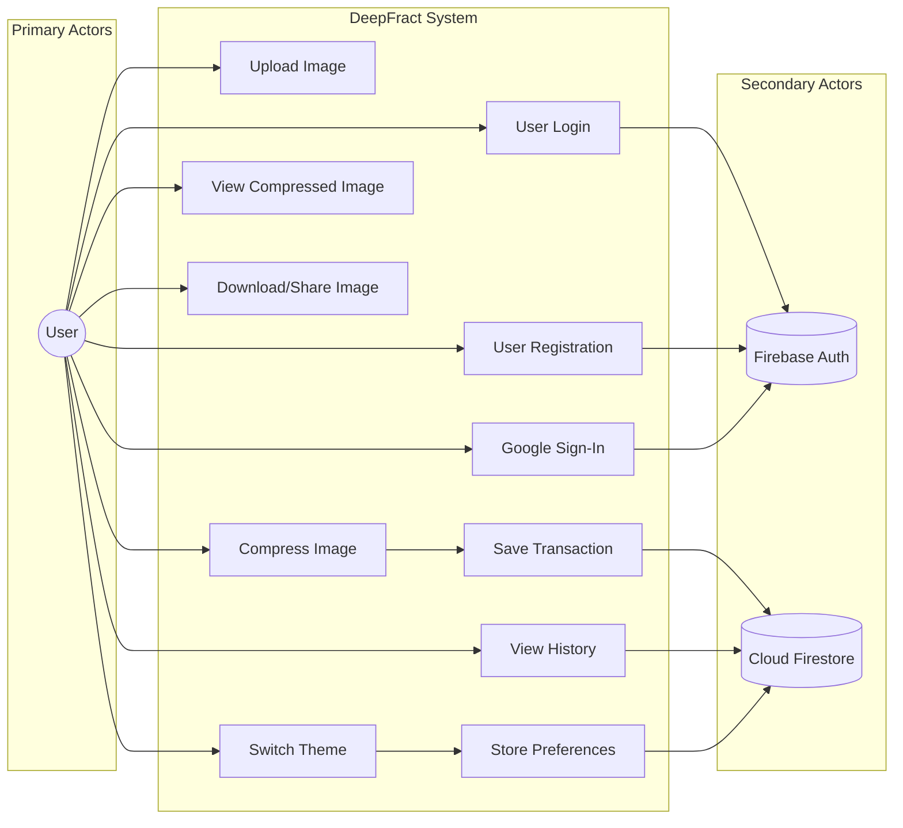

# Use Case Diagram - Database Entities Addition

> **Objective**: Add ONLY database-related entities while keeping the existing structure exactly as-is  
> **Standard**: UML 2.0 Academic Standards

---

## Overview

This document outlines the additions needed to include database entities in the DeepFract Use Case Diagram according to UML academic standards.

---

## Database Entity to Add

According to **UML academic standards**, when a system interacts with a database, you add it as a **Secondary Actor** (external system). This is placed on the **right side** of the system boundary.

### New Actors to Add

| Entity | Type | Symbol | Placement |
|--------|------|--------|-----------|
| **Firebase Auth** | Secondary Actor | Stick figure OR system icon | Right side |
| **Cloud Firestore** | Secondary Actor | Cylinder icon | Right side, below Firebase Auth |

---

## Database Connections (New Relationships)

### Firebase Authentication Actor

The **Firebase Auth** actor should connect to these use cases:

| Use Case | Relationship | Reason |
|----------|--------------|--------|
| **User Login** | ← (line) | Authenticates user credentials |
| **User Registration** | ← (line) | Creates new user account |
| **Google Sign-In** | ← (line) | OAuth authentication |
| **Password Reset** | ← (line) | Sends reset email |
| **Check Auth State** | ← (line) | Verifies session |

### Cloud Firestore Actor

The **Cloud Firestore** actor should connect to these use cases:

| Use Case | Relationship | Reason |
|----------|--------------|--------|
| **Save Compression Transaction** | ← (line) | Stores transaction record |
| **View Compression History** | ← (line) | Retrieves past compressions |
| **Get Compression Statistics** | ← (line) | Reads aggregated stats |
| **Delete Transaction** | ← (line) | Removes transaction record |
| **Store User Preferences** | ← (line) | Saves theme settings |

---

## Visual Representation of Changes

```
                    ┌─────────────────────────────────────────────────────────────────┐
                    │                    DeepFract System                              │
                    │                                                                  │
    ○               │    ┌──────────────────┐                                         │
   /│\   ──────────►│    │   User Login     │◄─────────────────────────────────────────┼──────  ┌───────┐
   / \              │    └──────────────────┘                                         │        │Firebase│
  User              │           │                                                     │        │  Auth  │
                    │           ▼                                                     │        └───────┘
                    │    ┌──────────────────┐                                         │
                    │    │ User Registration │◄────────────────────────────────────────┤
                    │    └──────────────────┘                                         │
                    │           │                                                     │
                    │           ▼                                                     │
                    │    ┌──────────────────┐                                         │
                    │    │  Google Sign-In  │◄─────────────────────────────────────────┤
                    │    └──────────────────┘                                         │
                    │                                                                  │
                    │    ┌──────────────────┐                                         │
                    │    │ Upload Image     │                                         │
                    │    └──────────────────┘                                         │
                    │           │                                                     │
                    │           ▼                                                     │
                    │    ┌──────────────────┐                                         │
                    │    │ Compress Image   │───────────┐                             │
                    │    └──────────────────┘           │                             │
                    │           │                       │                             │
                    │           ▼                       ▼                             │
                    │    ┌──────────────────┐    ┌──────────────────┐                 │
                    │    │View Compressed   │    │Save Compression  │◄────────────────┼──────  ╭─╮
                    │    │     Image        │    │   Transaction    │                 │        │ │
                    │    └──────────────────┘    └──────────────────┘                 │        ╰─╯
                    │           │                       │                             │       Cloud
                    │           ▼                       │                             │     Firestore
                    │    ┌──────────────────┐           │                             │
                    │    │Download/Share    │           │                             │
                    │    │     Image        │           ▼                             │
                    │    └──────────────────┘    ┌──────────────────┐                 │
                    │                            │View Compression  │◄────────────────┤
                    │    ┌──────────────────┐    │     History      │                 │
                    │    │  Switch Theme    │    └──────────────────┘                 │
                    │    └──────────────────┘           │                             │
                    │           │                       ▼                             │
                    │           └────────────────►┌──────────────────┐                 │
                    │                            │Store User        │◄────────────────┤
                    │                            │  Preferences     │                 │
                    │                            └──────────────────┘                 │
                    │                                                                  │
                    └─────────────────────────────────────────────────────────────────┘
```

---

## Exact Changes to Make

### Step 1: Add Firebase Auth Actor
- **Symbol**: Stick figure OR rectangle with system name
- **Position**: Right side of diagram
- **Label**: `Firebase Auth`

### Step 2: Add Cloud Firestore Actor
- **Symbol**: Cylinder icon (database symbol) OR stick figure
- **Position**: Right side of diagram, below Firebase Auth
- **Label**: `Cloud Firestore` (or `Firestore DB`)

### Step 3: Draw Connection Lines

Draw simple lines (not arrows) from actors to their related use cases:

**Firebase Auth connections:**
```
Firebase Auth ──────── User Login
Firebase Auth ──────── User Registration  
Firebase Auth ──────── Google Sign-In
Firebase Auth ──────── Password Reset
Firebase Auth ──────── Check Auth State
```

**Cloud Firestore connections:**
```
Cloud Firestore ──────── Save Compression Transaction
Cloud Firestore ──────── View Compression History  
Cloud Firestore ──────── Get Compression Statistics
Cloud Firestore ──────── Delete Transaction
Cloud Firestore ──────── Store User Preferences
```

> [!NOTE]
> In UML, secondary actors use **simple lines** (association), not arrows. The line shows the actor participates in the use case.

---

## Complete Use Case List

### User Actor Use Cases (Primary)

| Use Case | Description |
|----------|-------------|
| View Splash Screen | Initial branding display |
| Complete Onboarding | 3-page introduction flow |
| User Login | Email/password authentication |
| User Registration | Create new account |
| Google Sign-In | OAuth authentication |
| Password Reset | Email-based recovery |
| Upload Image | Select from gallery/camera |
| Compress Image | AI-powered compression |
| View Compressed Image | See compression result |
| Download Image | Save to device |
| Share Image | Share via apps |
| View Compression History | Past compressions |
| Switch Theme | Light/dark mode |
| View Profile | Account settings |
| Sign Out | End session |
| View About | App information |

### Firebase Auth Use Cases (Secondary)

| Use Case | Description |
|----------|-------------|
| Authenticate Credentials | Verify email/password |
| Create User Account | New registration |
| OAuth Authentication | Google sign-in |
| Send Reset Email | Password recovery |
| Validate Session | Check auth state |

### Cloud Firestore Use Cases (Secondary)

| Use Case | Description |
|----------|-------------|
| Store Transaction | Save compression record |
| Retrieve Transactions | Get user history |
| Calculate Statistics | Aggregate metrics |
| Delete Record | Remove transaction |
| Store Preferences | Save user settings |

---

## Summary of Additions

| What to Add | Count |
|-------------|-------|
| New Actors | 2 (Firebase Auth, Cloud Firestore) |
| New Use Cases | 0 (use cases implicit in connections) |
| New Relationships | 10 lines |
| Modifications to Existing | 0 |

---

## Academic Standard Reference

According to **UML 2.5 Specification** (OMG):
- Secondary actors (like databases, external systems) are placed on the **right side** of the system boundary
- They represent external entities that the system uses to perform its functions
- Connection lines show **participation** in use cases
- Database actors can be represented as:
  - Stick figures with stereotypes «database»
  - Cylinder icons (traditional database symbol)
  - Rectangles with system names

---

## Mermaid Diagram Representation



---

*No changes to existing structure, format, or entities - only database actors added*
